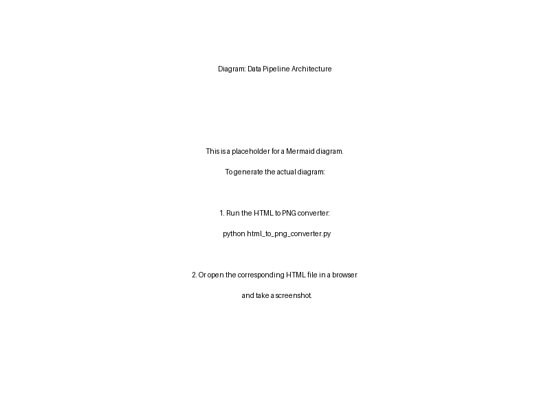
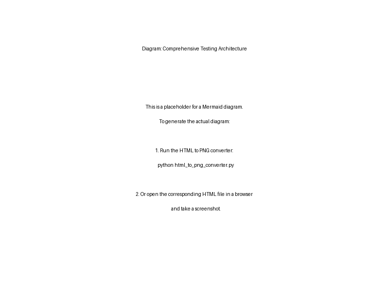

# Nifty 500 Trading System - Master Documentation

## Table of Contents
1. [System Overview](#system-overview)
2. [Data Collection Framework](#data-collection-framework)
3. [Technical Indicators](#technical-indicators)
4. [Market Regime Analysis](#market-regime-analysis)
5. [Relative Strength Analysis](#relative-strength-analysis)
6. [Comprehensive Testing Framework](#comprehensive-testing-framework)
7. [Implementation Guide](#implementation-guide)
8. [API Reference](#api-reference)

## System Overview

This trading system combines multiple approaches:
1. Technical Analysis with correlation-aware indicators
2. Market regime classification for adaptive strategies
3. Relative strength analysis for stock selection
4. Comprehensive backtesting and validation

The system is designed to analyze all stocks in the Nifty 500 index, providing both broad market insights and specific trading signals for individual securities.

## Data Collection Framework

### Overview
The data collection framework handles large-scale data acquisition for Nifty 500 stocks with built-in fault tolerance and data quality verification.

### Components

#### Symbol List Management
The system maintains an up-to-date list of Nifty 500 symbols along with their sector and industry classifications.

#### Data Sources
- **Primary**: NSE (National Stock Exchange) and Yahoo Finance
- **Backup**: Alternative financial data providers

#### Data Acquisition Process
1. **Historical Data**: 
   - Default 10-year historical OHLCV data
   - Intelligent caching to minimize redundant downloads
   - Batch processing with automatic error handling

2. **Real-time Data**: 
   - Live market data integration
   - Streaming data handling
   - Data validation and cleaning



### Implementation
The data download functionality is implemented in:
- `download_stock_data.py`: For individual stock data
- `download_nifty500_data.py`: For batch downloading all Nifty 500 stocks

## Technical Indicators

The system calculates and analyzes multiple technical indicators across different categories:

### Trend Indicators
- Moving Averages (SMA/EMA)
- MACD (Moving Average Convergence Divergence)
- ADX (Average Directional Index)
- Parabolic SAR

### Momentum Indicators
- RSI (Relative Strength Index)
- Stochastic Oscillator
- CCI (Commodity Channel Index)
- ROC (Rate of Change)

### Volatility Indicators
- Bollinger Bands
- ATR (Average True Range)
- Standard Deviation
- Keltner Channels

### Volume Indicators
- OBV (On-Balance Volume)
- Volume Profile
- Accumulation/Distribution Line
- Money Flow Index


Implementation details can be found in `technical_indicators.py`.

## Market Regime Analysis

The market regime analysis module identifies the current market state to adapt trading strategies accordingly.

### Market Regimes
1. **Trending Bull Market**: Strong uptrend with low volatility
2. **Trending Bear Market**: Strong downtrend with low volatility
3. **Volatile Bull Market**: Uptrend with high volatility
4. **Volatile Bear Market**: Downtrend with high volatility
5. **Sideways/Ranging Market**: No clear trend direction
6. **High Volatility Range**: Sideways with high volatility

### Identification Methods
- Trend strength analysis (ADX)
- Volatility measurement (ATR, Bollinger Bandwidth)
- Moving average relationships
- Correlation analysis


Implementation is available in `market_regime.py`.

## Relative Strength Analysis

The relative strength module compares stocks against their sectors and the broader market to identify outperformers.

### Key Metrics
- **RS Ratio**: Relative performance vs benchmark
- **RS Momentum**: Rate of change in relative performance
- **Sector Relative Strength**: Performance vs sector
- **Market Relative Strength**: Performance vs overall market

Implementation details are in `relative_strength.py`.

## Comprehensive Testing Framework

The testing framework validates all aspects of the system through:

### Test Scenarios
1. **Single Stock Analysis**: Detailed testing on individual stocks
2. **Market Regime Classification**: Validation of regime identification
3. **Relative Strength Calculation**: Testing RS metrics across market conditions
4. **Full System Testing**: End-to-end validation



Implementation is in `test_single_stock_comprehensive.py`.

## Implementation Guide

### Installation
```bash
# Clone the repository
git clone https://github.com/username/stock-trading-agentic.git
cd stock-trading-agentic

# Install dependencies
pip install -r requirements.txt
```

### Basic Usage
```python
# Download data for a single stock
from download_stock_data import download_stock_data
data = download_stock_data("RELIANCE.NS", start_date="2020-01-01")

# Calculate technical indicators
from technical_indicators import calculate_all_indicators
enhanced_data = calculate_all_indicators(data)

# Analyze market regime
from market_regime import analyze_market_regime
regime = analyze_market_regime(enhanced_data)

# Calculate relative strength
from relative_strength import calculate_relative_strength
rs_data = calculate_relative_strength(data, benchmark_data)
```

## API Reference

Detailed API documentation for all modules and functions.

### Data Download Module
```python
download_stock_data(symbol: str, start_date: str = None, end_date: str = None) -> pd.DataFrame
"""
Downloads historical stock data for a given symbol.

Parameters:
    symbol (str): Stock symbol with exchange suffix (.NS for NSE)
    start_date (str, optional): Start date in YYYY-MM-DD format
    end_date (str, optional): End date in YYYY-MM-DD format

Returns:
    pd.DataFrame: DataFrame containing OHLCV data
"""
```

### Technical Indicators Module
```python
calculate_all_indicators(data: pd.DataFrame) -> pd.DataFrame
"""
Calculates all technical indicators for the provided OHLCV data.

Parameters:
    data (pd.DataFrame): DataFrame with OHLCV columns

Returns:
    pd.DataFrame: Enhanced DataFrame with all indicators
"""
```

### Market Regime Module
```python
analyze_market_regime(data: pd.DataFrame) -> Dict[str, Any]
"""
Analyzes the market regime based on technical indicators.

Parameters:
    data (pd.DataFrame): DataFrame with technical indicators

Returns:
    Dict[str, Any]: Market regime classification and confidence
"""
```

### Relative Strength Module
```python
calculate_relative_strength(data: pd.DataFrame, benchmark: pd.DataFrame) -> Dict[str, pd.Series]
"""
Calculates relative strength metrics against a benchmark.

Parameters:
    data (pd.DataFrame): Stock OHLCV data
    benchmark (pd.DataFrame): Benchmark OHLCV data

Returns:
    Dict[str, pd.Series]: Dictionary of RS metrics
"""
```
