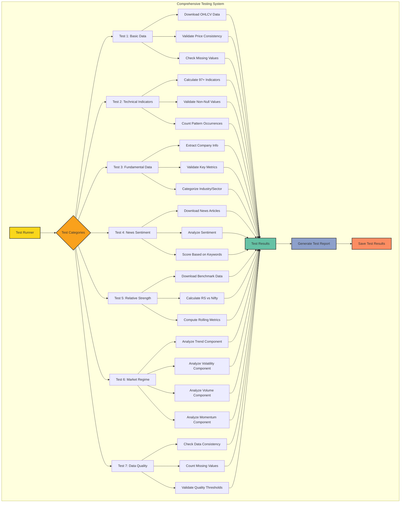

# Comprehensive Testing Architecture

The diagram below illustrates the comprehensive testing system used to validate the Nifty 500 data pipeline:

## Test Categories

The comprehensive testing system validates all aspects of the data pipeline through seven key test categories:

1. **Basic Data Test**: Verifies data download and basic quality checks
2. **Technical Indicators Test**: Validates all 97+ technical indicators are correctly calculated
3. **Fundamental Data Test**: Ensures company information and financial metrics are properly extracted
4. **News Sentiment Test**: Confirms news articles are retrieved and sentiment is analyzed
5. **Relative Strength Test**: Checks benchmark comparison calculations
6. **Market Regime Test**: Validates market condition analysis
7. **Data Quality Test**: Performs comprehensive data integrity checks

Each test category includes multiple validation steps to ensure complete coverage of all pipeline components.
