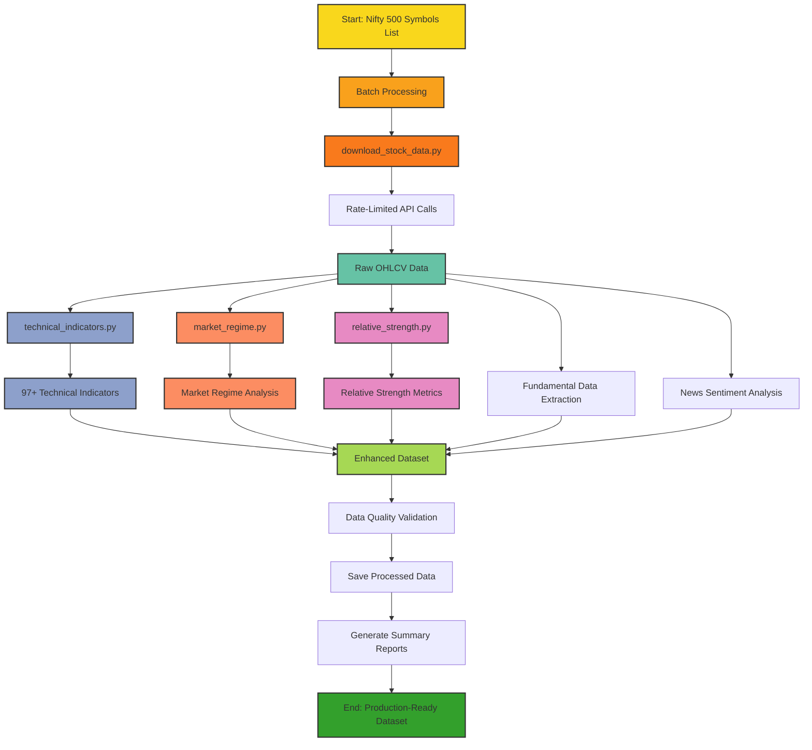

# Data Pipeline Architecture

The diagram below illustrates the complete Nifty 500 data download pipeline architecture:

## Pipeline Components

1. **Input Processing**: Nifty 500 symbols are loaded and processed in batches to respect API rate limits
2. **Data Acquisition**: Raw price and volume data is downloaded for each stock
3. **Technical Analysis**: 97+ technical indicators are calculated across multiple categories
4. **Market Context**: Market regime and relative strength analysis add contextual information
5. **Fundamental Integration**: Company information and financial metrics are incorporated
6. **Data Validation**: Comprehensive quality checks ensure data integrity
7. **Output Generation**: Processed data is saved in multiple formats with summary reports

This architecture ensures complete coverage of the Nifty 500 index while maintaining high data quality and computational efficiency.
