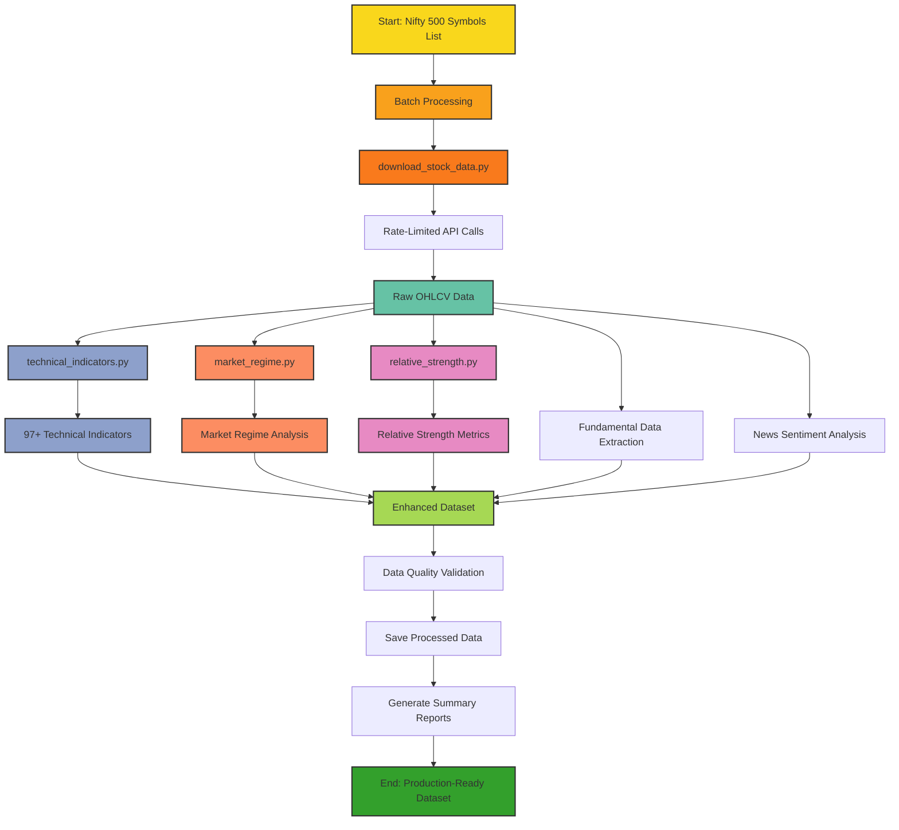

```mermaid
flowchart TD
    A[Start: Nifty 500 Symbols List] --> B[Batch Processing]
    B --> C[download_stock_data.py]
    C --> D[Rate-Limited API Calls]
    D --> E[Raw OHLCV Data]
    E --> F[technical_indicators.py]
    F --> G[97+ Technical Indicators]
    E --> H[market_regime.py]
    H --> I[Market Regime Analysis]
    E --> J[relative_strength.py]
    J --> K[Relative Strength Metrics]
    G --> L[Enhanced Dataset]
    I --> L
    K --> L
    E --> M[Fundamental Data Extraction]
    M --> L
    E --> N[News Sentiment Analysis]
    N --> L
    L --> O[Data Quality Validation]
    O --> P[Save Processed Data]
    P --> Q[Generate Summary Reports]
    Q --> R[End: Production-Ready Dataset]

    style A fill:#f9d71c,stroke:#333,stroke-width:2px
    style B fill:#f9a11c,stroke:#333,stroke-width:2px
    style C fill:#f97a1c,stroke:#333,stroke-width:2px
    style E fill:#66c2a5,stroke:#333,stroke-width:2px
    style F fill:#8da0cb,stroke:#333,stroke-width:2px
    style G fill:#8da0cb,stroke:#333,stroke-width:2px
    style H fill:#fc8d62,stroke:#333,stroke-width:2px
    style I fill:#fc8d62,stroke:#333,stroke-width:2px
    style J fill:#e78ac3,stroke:#333,stroke-width:2px
    style K fill:#e78ac3,stroke:#333,stroke-width:2px
    style L fill:#a6d854,stroke:#333,stroke-width:2px
    style R fill:#33a02c,stroke:#333,stroke-width:2px
```
