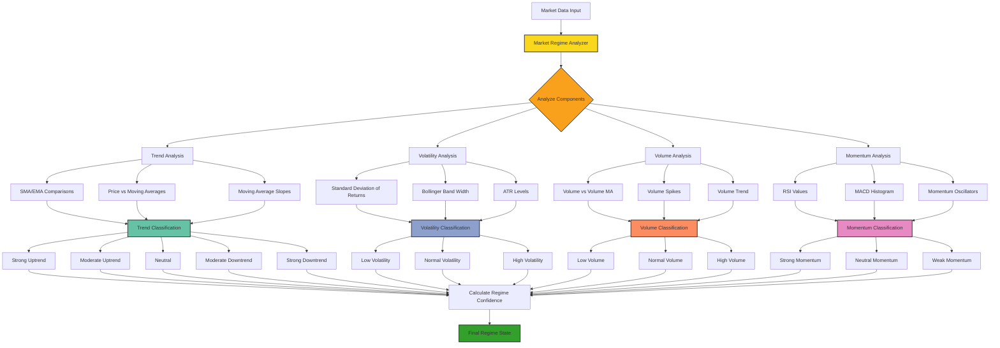

```mermaid
graph TD
    A[Market Data Input] --> B[Market Regime Analyzer]
    B --> C{Analyze Components}
    
    C --> D[Trend Analysis]
    C --> E[Volatility Analysis]
    C --> F[Volume Analysis]
    C --> G[Momentum Analysis]
    
    D --> D1[SMA/EMA Comparisons]
    D --> D2[Price vs Moving Averages]
    D --> D3[Moving Average Slopes]
    
    E --> E1[Standard Deviation of Returns]
    E --> E2[Bollinger Band Width]
    E --> E3[ATR Levels]
    
    F --> F1[Volume vs Volume MA]
    F --> F2[Volume Spikes]
    F --> F3[Volume Trend]
    
    G --> G1[RSI Values]
    G --> G2[MACD Histogram]
    G --> G3[Momentum Oscillators]
    
    D1 --> H[Trend Classification]
    D2 --> H
    D3 --> H
    H --> H1[Strong Uptrend]
    H --> H2[Moderate Uptrend]
    H --> H3[Neutral]
    H --> H4[Moderate Downtrend]
    H --> H5[Strong Downtrend]
    
    E1 --> I[Volatility Classification]
    E2 --> I
    E3 --> I
    I --> I1[Low Volatility]
    I --> I2[Normal Volatility]
    I --> I3[High Volatility]
    
    F1 --> J[Volume Classification]
    F2 --> J
    F3 --> J
    J --> J1[Low Volume]
    J --> J2[Normal Volume]
    J --> J3[High Volume]
    
    G1 --> K[Momentum Classification]
    G2 --> K
    G3 --> K
    K --> K1[Strong Momentum]
    K --> K2[Neutral Momentum]
    K --> K3[Weak Momentum]
    
    H1 --> L[Calculate Regime Confidence]
    H2 --> L
    H3 --> L
    H4 --> L
    H5 --> L
    I1 --> L
    I2 --> L
    I3 --> L
    J1 --> L
    J2 --> L
    J3 --> L
    K1 --> L
    K2 --> L
    K3 --> L
    
    L --> M[Final Regime State]
    
    style B fill:#f9d71c,stroke:#333,stroke-width:2px
    style C fill:#f9a11c,stroke:#333,stroke-width:2px
    style H fill:#66c2a5,stroke:#333,stroke-width:2px
    style I fill:#8da0cb,stroke:#333,stroke-width:2px
    style J fill:#fc8d62,stroke:#333,stroke-width:2px
    style K fill:#e78ac3,stroke:#333,stroke-width:2px
    style M fill:#33a02c,stroke:#333,stroke-width:2px
```
