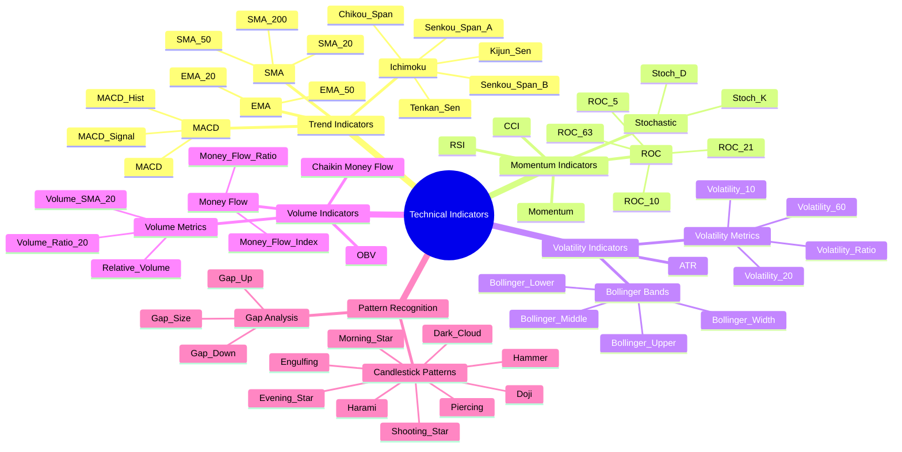

# Technical Indicators Classification

The diagram below provides a comprehensive categorization of the technical indicators used in the pipeline:

## Indicator Categories

The pipeline implements 97+ technical indicators across five major categories:

1. **Trend Indicators**: Identify the direction of price movements
2. **Momentum Indicators**: Measure the rate of price changes
3. **Volatility Indicators**: Analyze the magnitude of price fluctuations
4. **Volume Indicators**: Examine trading volume patterns
5. **Pattern Recognition**: Detect specific price patterns and formations

Each category contains multiple indicator families with various timeframes and parameter settings.
