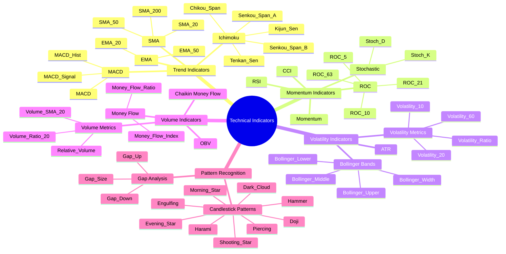

```mermaid
mindmap
  root((Technical Indicators))
    Trend Indicators
      SMA
        ::icon(fa fa-line-chart)
        SMA_20
        SMA_50
        SMA_200
      EMA
        ::icon(fa fa-line-chart)
        EMA_20
        EMA_50
      MACD
        ::icon(fa fa-line-chart)
        MACD
        MACD_Signal
        MACD_Hist
      Ichimoku
        ::icon(fa fa-cloud)
        Tenkan_Sen
        Kijun_Sen
        Senkou_Span_A
        Senkou_Span_B
        Chikou_Span
    Momentum Indicators
      ::icon(fa fa-dashboard)
      RSI
      Stochastic
        Stoch_K
        Stoch_D
      CCI
      ROC
        ROC_5
        ROC_10
        ROC_21
        ROC_63
      Momentum
    Volatility Indicators
      ::icon(fa fa-area-chart)
      Bollinger Bands
        Bollinger_Upper
        Bollinger_Middle
        Bollinger_Lower
        Bollinger_Width
      ATR
      Volatility Metrics
        Volatility_10
        Volatility_20
        Volatility_60
        Volatility_Ratio
    Volume Indicators
      ::icon(fa fa-bar-chart)
      OBV
      Money Flow
        Money_Flow_Index
        Money_Flow_Ratio
      Chaikin Money Flow
      Volume Metrics
        Volume_SMA_20
        Volume_Ratio_20
        Relative_Volume
    Pattern Recognition
      ::icon(fa fa-puzzle-piece)
      Candlestick Patterns
        Doji
        Engulfing
        Hammer
        Morning_Star
        Evening_Star
        Shooting_Star
        Harami
        Piercing
        Dark_Cloud
      Gap Analysis
        Gap_Up
        Gap_Down
        Gap_Size
```
