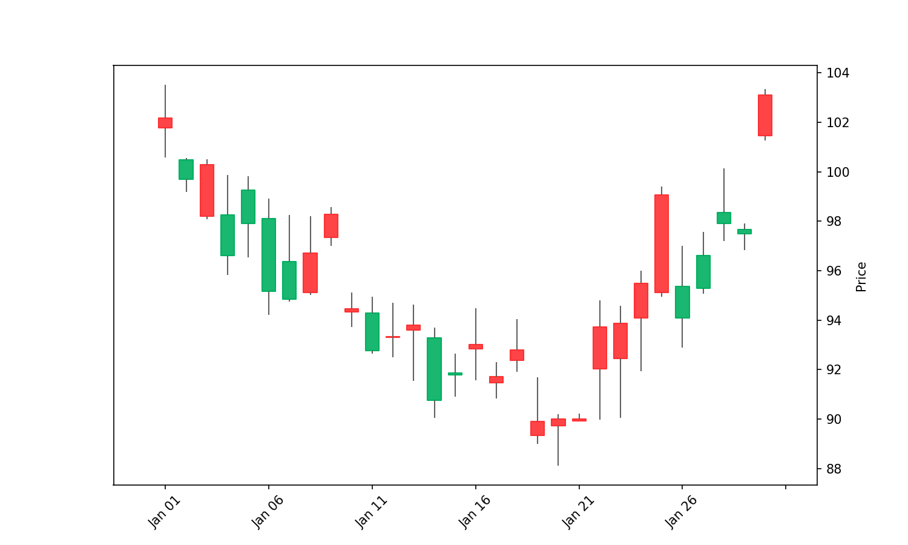
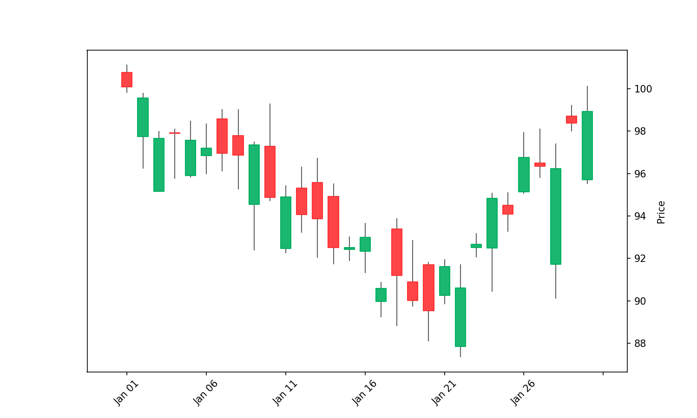
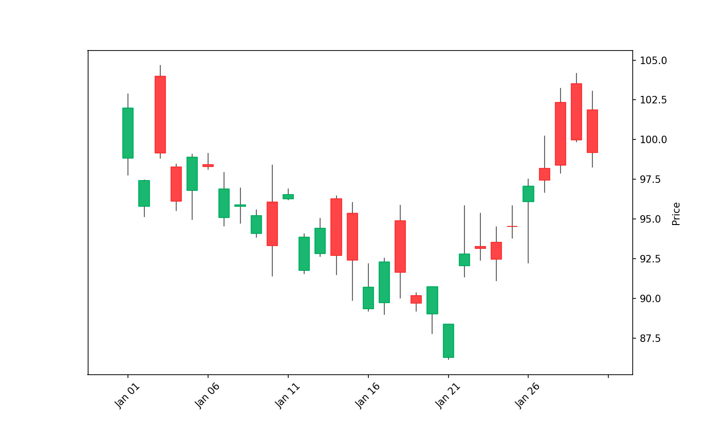
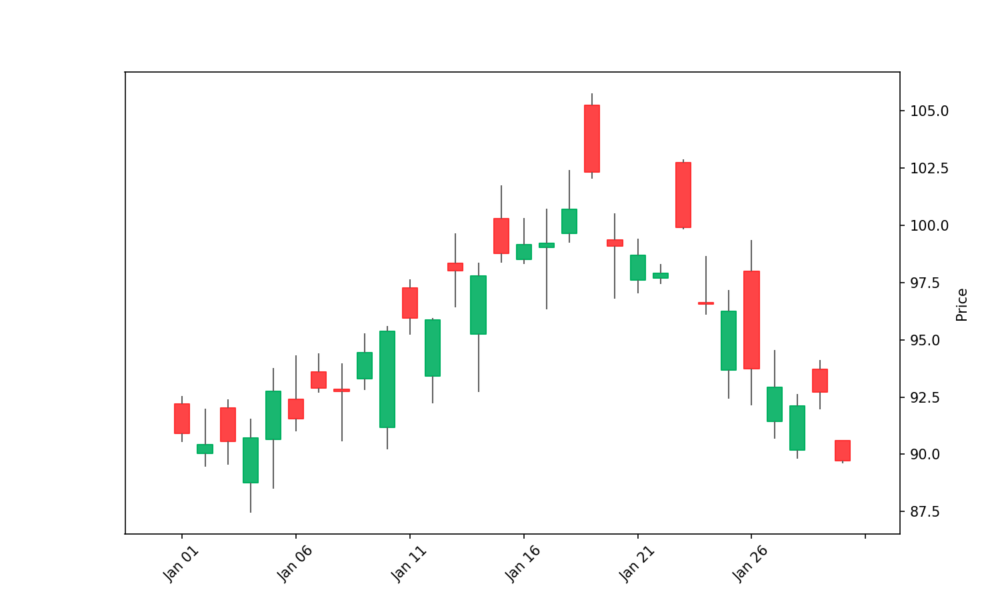
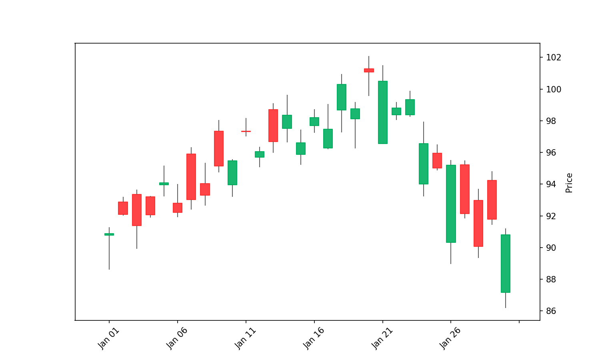
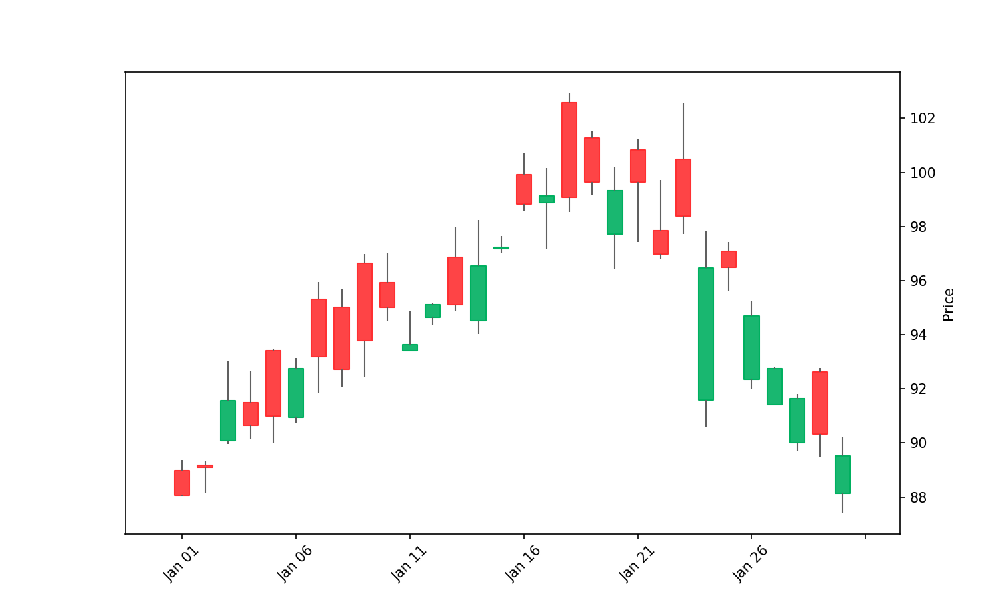
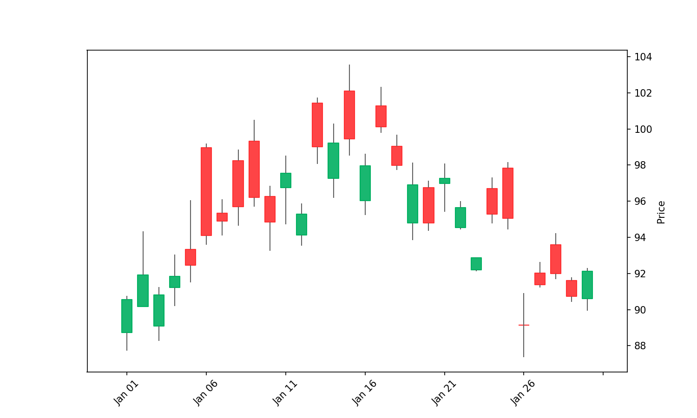
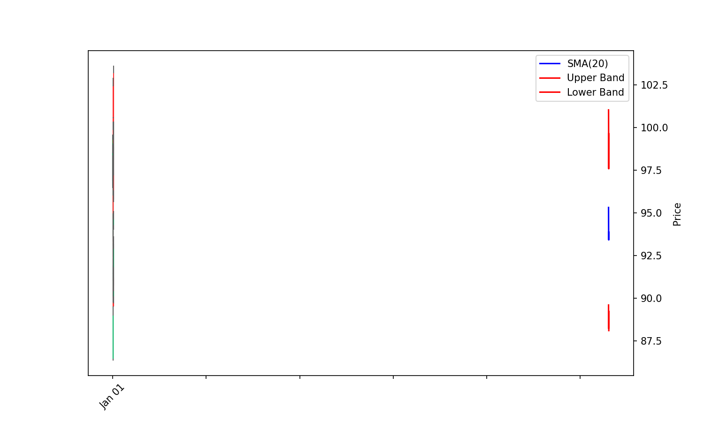
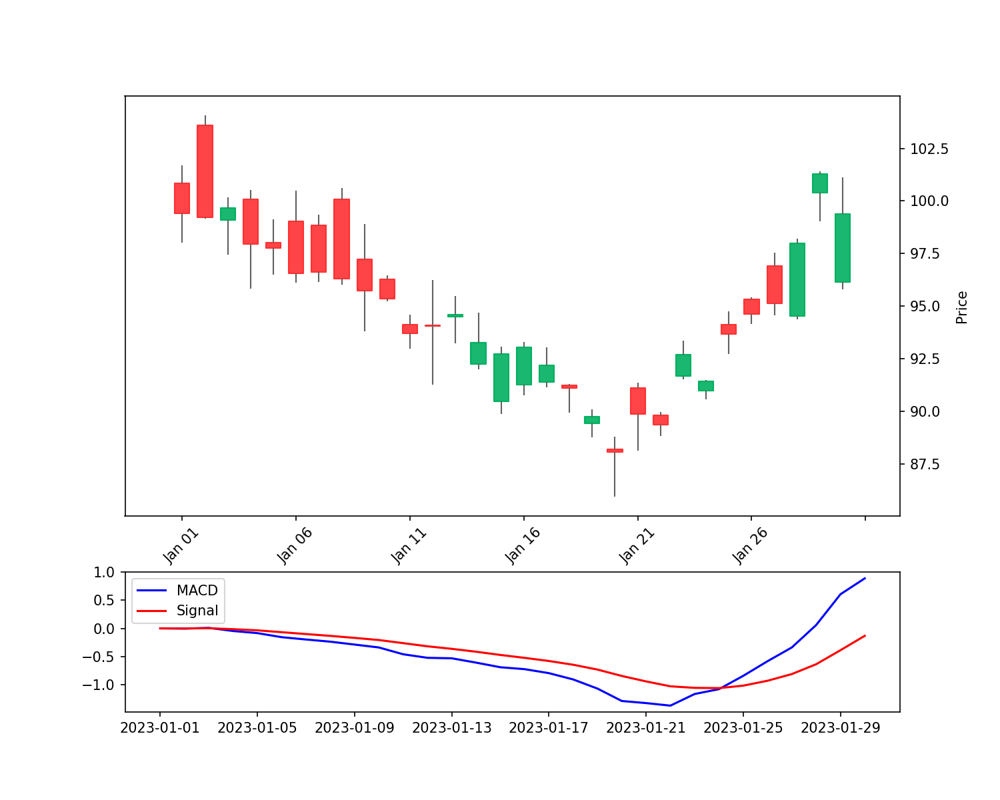

# Comprehensive Candlestick Pattern and Technical Indicator Guide

This document provides in-depth explanations of all candlestick patterns and technical indicators used in the Nifty 500 Trading System. Each pattern and indicator is explained in detail with visual characteristics, calculation methods, trading implications, and system-specific implementation notes.

## Table of Contents

1. [Single-Day Candlestick Patterns](#single-day-candlestick-patterns)
2. [Multi-Day Candlestick Patterns](#multi-day-candlestick-patterns)
3. [Price Action Patterns](#price-action-patterns)
4. [Technical Bands and Overlays](#technical-bands-and-overlays)
5. [Volatility Indicators](#volatility-indicators)
6. [Volume-Based Indicators](#volume-based-indicators)
7. [System-Specific Pattern Integration](#system-specific-pattern-integration)
8. [Market Regime Analysis](#market-regime-analysis)

## Single-Day Candlestick Patterns

### Bullish Patterns

#### Three White Soldiers (CDL3WHITESOLDIERS)
**Description:** Three consecutive bullish (white/green) candles, each opening within the previous candle's body and closing higher than the previous close. Represents strong buying pressure.

**Visual Characteristics:**
- Three consecutive bullish candles
- Each candle opens within the real body of the previous candle
- Each candle closes progressively higher
- Little to no upper shadows (ideally)

**Visual Example:**


**Reliability:** 90-100%

**Trading Implications:**
- Strong bullish reversal signal, especially after a downtrend
- Indicates sustained buying pressure and momentum
- More reliable with increasing volume over the three days

**System Implementation:**
```python
# Implementation via TA-Lib
result = talib.CDL3WHITESOLDIERS(open_prices, high_prices, low_prices, close_prices)
if result[-1] > 0:  # Bullish pattern
    patterns['CDL3WHITESOLDIERS'] = 1.0  # Highest reliability weight
```

**Context Requirements:**
- Most effective after a downtrend or in a consolidation area
- Confirmation by volume increase enhances reliability
- The longer the candles, the stronger the signal

---

#### Morning Star (CDLMORNINGSTAR)
**Description:** A three-candle bullish reversal pattern consisting of a large bearish candle, followed by a small-bodied candle (star) that gaps down, and completed by a bullish candle that gaps up and closes well into the first candle's body.

**Visual Characteristics:**
- First candle: Long bearish (red/black) candle
- Second candle: Small-bodied candle (doji or spinning top) with a gap down
- Third candle: Bullish (white/green) candle that closes well into the first candle's body
- Gaps between candles (though not strictly necessary in all markets)

**Visual Example:**


**Reliability:** 90-100%

**Trading Implications:**
- Strong bullish reversal signal, especially at the end of a downtrend
- Indicates a shift from bearish to bullish sentiment
- The deeper the third candle penetrates into the first candle's body, the stronger the signal

**System Implementation:**
```python
# Implementation via TA-Lib
result = talib.CDLMORNINGSTAR(open_prices, high_prices, low_prices, close_prices)
if result[-1] > 0:  # Bullish pattern
    patterns['CDLMORNINGSTAR'] = 1.0  # Highest reliability weight
```

**Context Requirements:**
- Must occur after a definite downtrend
- The star should ideally have minimal body size
- Volume profile: decreasing on first candle, low on star, increasing on third candle

---

#### Piercing Pattern (CDLPIERCING)
**Description:** A two-candle bullish reversal pattern where a bearish candle is followed by a bullish candle that opens below the previous close but closes above the midpoint of the previous candle's body.

**Visual Characteristics:**
- First candle: Bearish (red/black) with substantial body
- Second candle: Bullish (white/green) that opens below previous low
- Second candle closes above the midpoint of the first candle's body
- Second candle penetrates at least 50% into the first candle's body

**Visual Example:**


**Reliability:** 80-90%

**Trading Implications:**
- Moderate to strong bullish reversal signal
- Indicates buyers overcoming sellers after a downtrend
- The deeper the penetration into the first candle's body, the stronger the signal

**System Implementation:**
```python
# Implementation via TA-Lib
result = talib.CDLPIERCING(open_prices, high_prices, low_prices, close_prices)
if result[-1] > 0:  # Bullish pattern
    patterns['CDLPIERCING'] = 0.9  # High reliability weight
```

**Context Requirements:**
- Should appear after a downtrend
- Higher reliability with confirmation from volume increase on second candle
- Works best in markets with defined sessions (with true gaps)

---

#### Bullish Engulfing (CDLENGULFING)
**Description:** A two-candle bullish reversal pattern where a small bearish candle is completely engulfed by a larger bullish candle that opens lower and closes higher than the previous candle.

**Visual Characteristics:**
- First candle: Small to medium bearish (red/black) candle
- Second candle: Larger bullish (white/green) candle
- Second candle completely engulfs the body of the first candle
- Second candle may or may not engulf the shadows of the first candle

**Visual Example:**


**Reliability:** 80-85%

**Trading Implications:**
- Strong bullish reversal signal
- Indicates buyers overwhelmed sellers
- The larger the second candle relative to the first, the stronger the signal

**System Implementation:**
```python
# Implementation via TA-Lib
result = talib.CDLENGULFING(open_prices, high_prices, low_prices, close_prices)
if result[-1] > 0:  # Bullish pattern
    patterns['CDLENGULFING'] = 0.85  # High reliability weight
```

**Context Requirements:**
- Most effective at the bottom of a downtrend
- Confirmation by higher volume on engulfing candle increases reliability
- More reliable when the engulfing candle engulfs multiple previous candles

---

#### Hammer (CDLHAMMER)
**Description:** A single-candle bullish reversal pattern with a small body at the top, little or no upper shadow, and a long lower shadow that's at least twice the length of the body. The Hammer signals that selling pressure initially drove prices down, but buyers ultimately regained control.

**Market Context:** 
The Hammer pattern is most effective when it appears after a downtrend or in an oversold region, often serving as the first signal of a potential trend reversal. It shows that despite selling pressure, buyers were able to push the price back up by close, indicating a potential shift in market sentiment.

**Visual Characteristics:**
- Small body at the upper end of the trading range
- Little or no upper shadow
- Long lower shadow (at least 2x the body length)
- Body color is less important, but a bullish (white/green) body is slightly more bullish
- Typically occurs after a downtrend

**Visual Example:**


**Reliability:** 75-80%

**Trading Implications:**
- Moderate to strong bullish reversal signal
- Shows that sellers drove prices down but buyers regained control by close
- Requires confirmation by a bullish candle or strong volume on the following day
- Most effective when appearing after a prolonged downtrend
- Often signals a good entry point for long positions with a stop-loss below the low of the hammer
- The longer the lower shadow, the more significant the potential reversal

**System Implementation:**
```python
# Implementation via TA-Lib
result = talib.CDLHAMMER(open_prices, high_prices, low_prices, close_prices)
if result[-1] > 0:  # Bullish pattern
    patterns['CDLHAMMER'] = 0.8  # Medium-high reliability weight
```

**Context Requirements:**
- Must occur after a downtrend to be considered a reversal pattern
- More reliable when the lower shadow penetrates a support level
- Confirmation on the next candle is important for validation

---

#### Inverted Hammer (CDLINVERTEDHAMMER)
**Description:** A single-candle bullish reversal pattern resembling an upside-down hammer with a small body at the lower end, little or no lower shadow, and a long upper shadow.

**Visual Characteristics:**
- Small body at the lower end of the trading range
- Little or no lower shadow
- Long upper shadow (at least 2x the body length)
- Body color is less important, but a bullish (white/green) body is preferred

**Visual Example:**


**Reliability:** 70-75%

**Trading Implications:**
- Moderate bullish reversal signal
- Shows buyers pushed prices up but couldn't sustain the high, yet sellers couldn't push back below the open
- Requires strong confirmation on following candle

**System Implementation:**
```python
# Implementation via TA-Lib
result = talib.CDLINVERTEDHAMMER(open_prices, high_prices, low_prices, close_prices)
if result[-1] > 0:  # Bullish pattern
    patterns['CDLINVERTEDHAMMER'] = 0.75  # Medium reliability weight
```

**Context Requirements:**
- Must appear after a downtrend
- Requires confirmation by a strong bullish candle on the following day
- Volume spike on the inverted hammer day increases reliability

### Bearish Patterns

#### Three Black Crows (CDL3BLACKCROWS)
**Description:** Three consecutive bearish (black/red) candles, each opening within the previous candle's body and closing lower than the previous close. Represents strong selling pressure.

**Visual Characteristics:**
- Three consecutive bearish candles
- Each candle opens within the real body of the previous candle
- Each candle closes progressively lower
- Little to no lower shadows (ideally)

**Visual Example:**


**Reliability:** 90-100%

**Trading Implications:**
- Strong bearish reversal signal, especially after an uptrend
- Indicates sustained selling pressure and downward momentum
- More reliable with increasing volume over the three days

**System Implementation:**
```python
# Implementation via TA-Lib
result = talib.CDL3BLACKCROWS(open_prices, high_prices, low_prices, close_prices)
if result[-1] < 0:  # Bearish pattern
    patterns['CDL3BLACKCROWS'] = -1.0  # Highest reliability weight
```

**Context Requirements:**
- Most effective after an uptrend
- More reliable when each candle closes near its low
- Volume should ideally increase with each candle

---

#### Evening Star (CDLEVENINGSTAR)
**Description:** A three-candle bearish reversal pattern consisting of a large bullish candle, followed by a small-bodied candle (star) that gaps up, and completed by a bearish candle that gaps down and closes well into the first candle's body.

**Visual Characteristics:**
- First candle: Long bullish (white/green) candle
- Second candle: Small-bodied candle (doji or spinning top) with a gap up
- Third candle: Bearish (red/black) candle that closes well into the first candle's body
- Gaps between candles (though not strictly necessary in all markets)

**Visual Example:**


**Reliability:** 90-100%

**Trading Implications:**
- Strong bearish reversal signal, especially at the end of an uptrend
- Indicates a shift from bullish to bearish sentiment
- The deeper the third candle penetrates into the first candle's body, the stronger the signal

**System Implementation:**
```python
# Implementation via TA-Lib
result = talib.CDLEVENINGSTAR(open_prices, high_prices, low_prices, close_prices)
if result[-1] < 0:  # Bearish pattern
    patterns['CDLEVENINGSTAR'] = -1.0  # Highest reliability weight
```

**Context Requirements:**
- Must occur after an uptrend
- The star should ideally have minimal body size
- Volume profile: decreasing on first candle, low on star, increasing on third candle

---

#### Dark Cloud Cover (CDLDARKCLOUDCOVER)
**Description:** A two-candle bearish reversal pattern where a bullish candle is followed by a bearish candle that opens above the previous high but closes below the midpoint of the previous candle's body.

**Visual Characteristics:**
- First candle: Bullish (white/green) with substantial body
- Second candle: Bearish (red/black) that opens above previous high
- Second candle closes below the midpoint of the first candle's body
- Second candle penetrates at least 50% into the first candle's body

**Visual Example:**


**Reliability:** 80-90%

**Trading Implications:**
- Moderate to strong bearish reversal signal
- Indicates sellers overcoming buyers after an uptrend
- The deeper the penetration into the first candle's body, the stronger the signal

**System Implementation:**
```python
# Implementation via TA-Lib
result = talib.CDLDARKCLOUDCOVER(open_prices, high_prices, low_prices, close_prices, penetration=0.5)
if result[-1] < 0:  # Bearish pattern
    patterns['CDLDARKCLOUDCOVER'] = -0.9  # High reliability weight
```

**Context Requirements:**
- Should appear after an uptrend
- Higher reliability with confirmation from volume increase on second candle
- Works best in markets with defined sessions (with true gaps)

---

#### Bearish Engulfing (CDLENGULFING)
**Description:** A two-candle bearish reversal pattern where a small bullish candle is completely engulfed by a larger bearish candle that opens higher and closes lower than the previous candle.

**Visual Characteristics:**
- First candle: Small to medium bullish (white/green) candle
- Second candle: Larger bearish (red/black) candle
- Second candle completely engulfs the body of the first candle
- Second candle may or may not engulf the shadows of the first candle

**Visual Example:**


**Reliability:** 80-85%

**Trading Implications:**
- Strong bearish reversal signal
- Indicates sellers overwhelmed buyers
- The larger the second candle relative to the first, the stronger the signal

**System Implementation:**
```python
# Implementation via TA-Lib
result = talib.CDLENGULFING(open_prices, high_prices, low_prices, close_prices)
if result[-1] < 0:  # Bearish pattern
    patterns['CDLENGULFING'] = -0.85  # High reliability weight
```

**Context Requirements:**
- Most effective at the top of an uptrend
- Confirmation by higher volume on engulfing candle increases reliability
- More reliable when the engulfing candle engulfs multiple previous candles

---

#### Shooting Star (CDLSHOOTINGSTAR)
**Description:** A single-candle bearish reversal pattern with a small body at the lower end, little or no lower shadow, and a long upper shadow that's at least twice the length of the body. The Shooting Star signals that buyers initially pushed prices up significantly during the session but lost control to sellers by the close.

**Market Context:**
The Shooting Star is most effective when it appears after an uptrend or at resistance levels. Its long upper shadow represents a failed rally where prices were pushed significantly higher during the session but were unable to sustain these gains. This failed buying pressure suggests that bullish momentum may be exhausting and a reversal could be imminent.

**Visual Characteristics:**
- Small body at the lower end of the trading range
- Little or no lower shadow
- Long upper shadow (at least 2x the body length)
- Body color is less important, but a bearish (red/black) body is slightly more bearish
- Must appear during an uptrend to be valid
- Often occurs near resistance levels or after a strong upward move

**Visual Example:**


**Reliability:** 75-80%

**Trading Implications:**
- Moderate to strong bearish reversal signal
- Shows that buyers drove prices up but couldn't sustain the high, and sellers took control by close
- Requires confirmation by a bearish candle or strong volume on the following day
- The longer the upper shadow, the more significant the potential reversal
- Often signals a good opportunity to take profits on long positions or initiate short positions
- Stop-loss should be placed above the high of the Shooting Star
- When combined with overbought indicators and resistance levels, significantly increases reliability

**System Implementation:**
```python
# Implementation via TA-Lib
result = talib.CDLSHOOTINGSTAR(open_prices, high_prices, low_prices, close_prices)
if result[-1] < 0:  # Bearish pattern
    patterns['CDLSHOOTINGSTAR'] = -0.8  # Medium-high reliability weight
```

**Context Requirements:**
- Must occur after an uptrend to be considered a reversal pattern
- More reliable when the upper shadow penetrates a resistance level
- Confirmation on the next candle is important for validation

---

#### Hanging Man (CDLHANGINGMAN)
**Description:** A single-candle bearish reversal pattern that looks identical to a hammer but appears after an uptrend. It has a small body at the top, little or no upper shadow, and a long lower shadow. The Hanging Man signals that despite the uptrend, significant selling pressure emerged during the session.

**Market Context:**
The Hanging Man is specifically a bearish signal when it appears after an uptrend or at resistance levels. While the pattern looks identical to the Hammer, its interpretation is entirely different due to market context. The long lower shadow indicates that sellers were able to push prices significantly lower during the session, although buyers managed to push it back up by close. This selling pressure during an uptrend is a warning sign.

**Visual Characteristics:**
- Small body at the upper end of the trading range
- Little or no upper shadow
- Long lower shadow (at least 2x the body length)
- Body color is less important, but a bearish (red/black) body is slightly more bearish
- Must appear during an uptrend to be valid

**Visual Example:**


**Reliability:** 70-75%

**Trading Implications:**
- Moderate to strong bearish reversal signal
- Shows that sellers were able to push prices down significantly during the session
- Requires confirmation by a bearish candle on the following day
- Suggests potential exhaustion of buying pressure
- The longer the lower shadow, the more significant the potential reversal
- Often signals a good opportunity to take profits on long positions or initiate short positions
- Stop-loss should be placed above the high of the Hanging Man pattern

**System Implementation:**
```python
# Implementation via TA-Lib
result = talib.CDLHANGINGMAN(open_prices, high_prices, low_prices, close_prices)
if result[-1] < 0:  # Bearish pattern
    patterns['CDLHANGINGMAN'] = -0.75  # Medium reliability weight
```

**Context Requirements:**
- Must occur after an uptrend
- More reliable with confirmation from the following candle
- Often signals a temporary pullback rather than a complete trend reversal

### Neutral Patterns

#### Doji (CDLDOJI)
**Description:** A candlestick with a very small body where the open and close prices are virtually equal. It signals market indecision and a potential trend reversal depending on context.

**Types of Doji Patterns:**
1. **Standard Doji:** Open and close are equal with upper and lower shadows of similar length
2. **Long-Legged Doji:** Features exceptionally long upper and lower shadows, indicating extreme volatility
3. **Dragonfly Doji:** Has a long lower shadow and virtually no upper shadow; bullish reversal signal at support
4. **Gravestone Doji:** Has a long upper shadow and virtually no lower shadow; bearish reversal signal at resistance
5. **Four Price Doji:** Extremely rare pattern where open, high, low, and close are all equal, indicating complete market standstill

**Visual Characteristics:**
- Opening and closing prices are the same or very close
- Can have upper and lower shadows of varying lengths
- The body is so small it resembles a cross, plus sign, or dash
- Location within the trading range and shadow lengths provide critical context

**Visual Example:**


**Reliability:** 70-75% (depends on context and type)

**Trading Implications:**
- Signals indecision in the market and potential equilibrium between buyers and sellers
- After a strong uptrend, suggests buyer exhaustion and potential bearish reversal
- After a strong downtrend, suggests seller exhaustion and potential bullish reversal
- In a ranging market, suggests continuation of indecision
- Most effective when combined with support/resistance levels and volume confirmation

**System Implementation:**
```python
# Implementation via TA-Lib
result = talib.CDLDOJI(open_prices, high_prices, low_prices, close_prices)
if result[-1] != 0:  # Doji detected
    # Context-dependent interpretation
    if in_uptrend:
        patterns['CDLDOJI'] = -0.7  # Potential bearish reversal
    elif in_downtrend:
        patterns['CDLDOJI'] = 0.7  # Potential bullish reversal
    else:
        patterns['CDLDOJI'] = 0  # Neutral in a ranging market
```

**Context Requirements:**
- Importance depends on preceding price action
- More significant after a strong trend
- Look for confirmation in subsequent price action
- Dragonfly doji (long lower shadow) or gravestone doji (long upper shadow) have different implications

## Technical Bands and Overlays

### Bollinger Bands
**Description:** A volatility-based indicator consisting of three bands: a middle band (usually a 20-period SMA) and upper/lower bands set at standard deviation levels above and below the middle band.

**Calculation:**
```
Middle Band = 20-period SMA
Upper Band = Middle Band + (20-period standard deviation × 2)
Lower Band = Middle Band - (20-period standard deviation × 2)
```

**Visual Example:**


**Interpretation:**
- Price touching or exceeding the bands may indicate overbought/oversold conditions
- Band contraction indicates low volatility (often preceding sharp price movements)
- Band expansion indicates high volatility
- "Walking the band" (price consistently touching a band) suggests strong trend

**Trading Applications:**
- Mean reversion: When price touches bands in ranging markets
- Trend continuation: When price "walks the band" in trending markets
- Volatility breakout: When bands contract significantly

**System Implementation:**
```python
# Calculate Bollinger Bands
upper, middle, lower = talib.BBANDS(close_prices, timeperiod=20, nbdevup=2, nbdevdn=2, matype=0)

# Strategy signals
if close_prices[-1] > upper[-1]:
    signals['bollinger_overbought'] = True
elif close_prices[-1] < lower[-1]:
    signals['bollinger_oversold'] = True
    
# Volatility measurement
band_width = (upper[-1] - lower[-1]) / middle[-1]
signals['volatility_ratio'] = band_width
```

**Context Requirements:**
- Period and standard deviation settings can be adjusted based on market and timeframe
- Works best when combined with other indicators for confirmation
- Different in effectiveness across trending vs. ranging markets

### Moving Average Convergence Divergence (MACD)
**Description:** A trend-following momentum indicator that shows the relationship between two moving averages of a security's price.

**Calculation:**
```
MACD Line = 12-period EMA - 26-period EMA
Signal Line = 9-period EMA of MACD Line
Histogram = MACD Line - Signal Line
```

**Visual Example:**


**Interpretation:**
- MACD crossing above signal line: Bullish signal
- MACD crossing below signal line: Bearish signal
- MACD crossing zero line: Trend direction confirmation
- Divergence between MACD and price: Potential reversal

**Trading Applications:**
- Signal line crossovers for entry/exit points
- Zero line crossovers for trend direction
- Histogram for momentum measurement
- Divergence for potential reversal signals

**System Implementation:**
```python
# Calculate MACD
macd, signal, histogram = talib.MACD(close_prices, fastperiod=12, slowperiod=26, signalperiod=9)

# Signal line crossover
if macd[-1] > signal[-1] and macd[-2] <= signal[-2]:
    signals['macd_bullish_cross'] = True
elif macd[-1] < signal[-1] and macd[-2] >= signal[-2]:
    signals['macd_bearish_cross'] = True
    
# Zero line crossover
if macd[-1] > 0 and macd[-2] <= 0:
    signals['macd_bullish_zero_cross'] = True
elif macd[-1] < 0 and macd[-2] >= 0:
    signals['macd_bearish_zero_cross'] = True
```

**Context Requirements:**
- More effective in trending markets than in ranging markets
- Signal quality depends on timeframe and market volatility
- Parameters can be adjusted for different market conditions
- Often combined with other indicators for confirmation

## Market Regime Analysis

### Bull Market Characteristics
**Description:** Periods characterized by sustained upward price movement, generally defined as a rise of 20% or more from recent lows.

**Visual Example:**


**System Strategy Adjustments:**
- Emphasize trend-following strategies
- Increase position sizes gradually
- Use looser stop-loss levels
- Focus on momentum signals
- Look for pullbacks as buying opportunities

### Bear Market Characteristics
**Description:** Periods characterized by sustained downward price movement, generally defined as a decline of 20% or more from recent highs.

**Visual Example:**


**System Strategy Adjustments:**
- Emphasize mean-reversion strategies
- Reduce position sizes significantly
- Use tighter stop-loss levels
- Focus on defensive assets
- Consider inverse ETFs or short positions
- Increase cash allocation

### Sideways/Ranging Market Characteristics
**Description:** Periods where prices move within a defined range, with no clear upward or downward trend.

**Visual Example:**


**System Strategy Adjustments:**
- Emphasize range-bound trading strategies
- Reduce position sizes moderately
- Focus on overbought/oversold indicators
- Set profit targets within the established range
- Use tighter stop-loss levels outside the range
- Consider option strategies for range-bound markets

### Volatility Regime Analysis
**Description:** Categorizing market conditions based on the level of price fluctuation and unpredictability.

**Visual Example:**


**System Strategy Adjustments:**
- Low Volatility: Increase position sizes, use trend-following strategies
- Medium Volatility: Balanced approach, normal position sizing
- High Volatility: Reduce position sizes, focus on mean-reversion, increase hedging

### Market Regime Transitions
**Description:** Identifying and navigating transitional periods between different market regimes to adjust strategy parameters dynamically.

**Visual Example:**


**Key Transition Characteristics:**
- Regime transitions often preceded by volatility spikes
- Changes in correlation structures between assets and sectors
- Breakdown of previously reliable technical patterns
- Shifts in volume profiles and market breadth
- Changes in market sentiment and institutional positioning

**System Strategy Adjustments During Transitions:**
- Reduce overall exposure during detected transition periods
- Increase diversification across uncorrelated strategies
- Focus on shorter-term signals until new regime is established
- Gradually adjust position sizing to match the emerging regime
- Monitor macro indicators for confirmation of regime shift

**Implementation:**
```python
# Calculate historical volatility
def get_volatility_regime(prices, window=20):
    returns = np.log(prices / prices.shift(1))
    volatility = returns.rolling(window=window).std() * np.sqrt(252)  # Annualized
    
    # Define regime thresholds
    low_vol_threshold = volatility.quantile(0.33)
    high_vol_threshold = volatility.quantile(0.67)
    
    if volatility.iloc[-1] < low_vol_threshold:
        return "low_volatility"
    elif volatility.iloc[-1] > high_vol_threshold:
        return "high_volatility"
    else:
        return "medium_volatility"
```

## System-Specific Pattern Integration

### Pattern Confidence Scoring
The Nifty 500 Trading System assigns confidence scores to each pattern based on:

1. **Historical reliability**: Back-tested accuracy of the pattern in the Indian market
2. **Market context**: Higher scores in appropriate market regimes
3. **Confirmation factors**: Volume, supporting indicators, and multi-timeframe alignment
4. **Pattern quality**: How closely the pattern matches ideal specifications
5. **Volatility regime**: Pattern reliability varies across different volatility environments

**Market Regime Considerations for Pattern Scoring:**
- **Bull Markets**: Higher weights assigned to continuation patterns; lower thresholds for bullish reversal patterns
- **Bear Markets**: Higher weights assigned to bearish reversal patterns at resistance; lower thresholds for continuation patterns
- **Sideways Markets**: Higher weights for range-bound trading patterns; lower weights for breakout patterns
- **Regime Transitions**: Reduced confidence scores during detected transition periods until new regime is established
- **High Volatility**: Higher thresholds required for all pattern signals; preference for patterns with strong confirmation

**Implementation Example:**
```python
def pattern_confidence_score(pattern_type, pattern_signal, volume_confirm, indicator_confirm, regime, volatility_regime):
    # Base reliability from historical testing
    base_reliability = PATTERN_RELIABILITY.get(pattern_type, 0.5)
    
    # Context adjustment based on market regime
    regime_multiplier = REGIME_COMPATIBILITY.get((pattern_type, regime), 0.7)
    
    # Volatility adjustment
    volatility_factor = 1.0
    if volatility_regime == "high_volatility":
        volatility_factor = 0.8  # Reduce confidence in high volatility
    elif volatility_regime == "low_volatility":
        volatility_factor = 1.2  # Increase confidence in low volatility
    
    # Regime transition detection
    is_transition = detect_regime_transition(regime_history)
    transition_factor = 0.7 if is_transition else 1.0
    
    # Confirmation factors
    confirmation_score = 0
    if volume_confirm:
        confirmation_score += 0.2
    if indicator_confirm:
        confirmation_score += 0.3
    
    # Final confidence score (capped at 1.0)
    confidence = min(base_reliability * regime_multiplier + confirmation_score, 1.0)
    
    # Adjust sign based on pattern signal (bullish/bearish)
    return confidence if pattern_signal > 0 else -confidence
```

### Pattern Combination Logic

The system leverages the power of pattern combinations while adapting to different market regimes:

1. **Market-Aware Confirmation Clusters**:
   - Bull Market: Lower threshold required for bullish pattern clusters
   - Bear Market: Higher confirmation required for bullish signals
   - Sideways Market: Equal thresholds for both directions
   - Transition Periods: Increased confirmation requirements

2. **Adaptive Multi-timeframe Alignment**:
   - Higher weighting during trending regimes
   - Reduced importance during choppy or transitional periods
   - Volatility-adjusted timeframe selection
   - Dynamic lookback periods based on regime

3. **Regime-Specific Pattern Sequences**:
   - Bull Market: Focus on continuation and pullback patterns
   - Bear Market: Emphasis on reversal and breakdown patterns
   - Ranging Market: Range-bound pattern combinations
   - Transition Periods: Early regime change patterns

4. **Contextual Indicator Confluence**:
   - Volume profile analysis specific to each regime
   - Trend indicator alignments in trending markets
   - Oscillator emphasis in ranging markets
   - Volatility indicator weighting based on regime

**Visual Example:**


**Implementation:**
```python
def evaluate_pattern_combinations(daily_patterns, weekly_patterns, indicators, market_regime, volatility_regime):
    signal_strength = 0
    
    # Adjust thresholds based on market regime
    if market_regime == "bull":
        bullish_threshold = 2  # Lower threshold in bull market
        bearish_threshold = 3  # Higher threshold for bearish signals
    elif market_regime == "bear":
        bullish_threshold = 3  # Higher threshold in bear market
        bearish_threshold = 2  # Lower threshold for bearish signals
    else:  # sideways or transition
        bullish_threshold = bearish_threshold = 3  # Equal thresholds
    
    # Check for confirmation clusters with regime-aware thresholds
    daily_bullish = sum(1 for p, v in daily_patterns.items() if v > 0)
    daily_bearish = sum(1 for p, v in daily_patterns.items() if v < 0)
    
    # Apply regime-specific confirmation weights
    if daily_bullish >= bullish_threshold:
        signal_strength += 0.3 * get_regime_multiplier(market_regime, "bullish")
    elif daily_bearish >= bearish_threshold:
        signal_strength -= 0.3 * get_regime_multiplier(market_regime, "bearish")
    
    # Multi-timeframe alignment with regime adaptation
    timeframe_weight = 0.2
    if volatility_regime == "high_volatility":
        timeframe_weight *= 0.7  # Reduce multi-timeframe weight in high volatility
    
    for pattern, value in daily_patterns.items():
        if pattern in weekly_patterns and np.sign(value) == np.sign(weekly_patterns[pattern]):
            signal_strength += timeframe_weight * np.sign(value)
    
    # Indicator confluence with regime-specific weighting
    indicator_weight = 0.25
    
    # Adjust indicator weights based on market regime
    if market_regime == "trending":
        # In trending markets, emphasize trend indicators
        if 'macd_bullish_cross' in indicators and daily_bullish > 0:
            signal_strength += indicator_weight * 1.2
        if 'macd_bearish_cross' in indicators and daily_bearish > 0:
            signal_strength -= indicator_weight * 1.2
        if 'adx_strong_trend' in indicators:
            signal_strength *= 1.2  # Amplify signals in strong trends
            
    elif market_regime == "ranging":
        # In ranging markets, emphasize oscillators
        if 'rsi_oversold' in indicators and daily_bullish > 0:
            signal_strength += indicator_weight * 1.3
        if 'rsi_overbought' in indicators and daily_bearish > 0:
            signal_strength -= indicator_weight * 1.3
        
    # Volume confirmation with volatility adjustment
    volume_weight = 0.2
    if volatility_regime == "high_volatility":
        volume_weight *= 1.3  # Increase importance of volume in high volatility
        
    if 'volume_confirms_bullish' in indicators and signal_strength > 0:
        signal_strength += volume_weight
    if 'volume_confirms_bearish' in indicators and signal_strength < 0:
        signal_strength -= volume_weight
    
    # Final regime-based signal adjustment
    if is_regime_transition(market_regime):
        signal_strength *= 0.7  # Reduce signal strength during regime transitions
    
    return np.clip(signal_strength, -1.0, 1.0)  # Ensure signal stays within bounds
    
    return signal_strength
```

---

*Note: This guide integrates theoretical knowledge with practical implementation details specific to the Nifty 500 Trading System. While based on established technical analysis principles, strategy implementation has been optimized for Indian market characteristics and behavior.*
