# Test Results Summary

The visualization below shows a summary of the latest test results for KOTAKBANK.NS:

```mermaid
graph TD
    subgraph "KOTAKBANK.NS Test Results"
    
    A[Basic Data] --> A1["491 days of historical data<br/>High quality OHLCV data"]
    B[Technical Indicators] --> B1["63 technical indicators<br/>7 indicator categories"]
    C[Fundamental Data] --> C1["Company: Kotak Mahindra Bank Limited<br/>Sector: Financial Services"]
    D[News Sentiment] --> D1["10 news articles analyzed<br/>Neutral sentiment score"]
    E[Relative Strength] --> E1["RS vs Nifty 50: -10.0000<br/>Underperforming market"]
    F[Market Regime] --> F1["Trend: moderate_down<br/>Volatility: normal<br/>Volume: normal<br/>Momentum: neutral"]
    G[Data Quality] --> G1["Missing values: 3.76%<br/>Completeness score: 96.2%"]
    
    A1 --> Z[Test Status: ✅ PASSED]
    B1 --> Z
    C1 --> Z
    D1 --> Z
    E1 --> Z
    F1 --> Z
    G1 --> Z
    
    end
    
    style A fill:#f9d71c,stroke:#333,stroke-width:2px
    style B fill:#f9a11c,stroke:#333,stroke-width:2px
    style C fill:#f97a1c,stroke:#333,stroke-width:2px
    style D fill:#66c2a5,stroke:#333,stroke-width:2px
    style E fill:#8da0cb,stroke:#333,stroke-width:2px
    style F fill:#fc8d62,stroke:#333,stroke-width:2px
    style G fill:#e78ac3,stroke:#333,stroke-width:2px
    style Z fill:#33a02c,stroke:#333,stroke-width:4px
```

## Key Observations

1. All 7 test categories have passed successfully
2. 491 days of historical data provides a robust testing dataset
3. 63 technical indicators were successfully calculated
4. The stock is showing a "moderate_down" trend but with normal volatility
5. Relative strength shows significant underperformance against Nifty 50
6. Data quality is excellent at 96.2% completeness

This comprehensive test validates the entire data pipeline from data acquisition through technical analysis to market regime classification.
