# Nifty 500 Trading System: A Comprehensive Analysis

## Executive Summary

The Nifty 500 Trading System is an advanced algorithmic trading platform designed to achieve 15% monthly returns while maintaining a maximum drawdown risk of 5%. This document provides a detailed explanation of the system's architecture, components, methodology, and performance characteristics.

## Table of Contents

1. [Introduction](#1-introduction)

1. [System Architecture](#2-system-architecture)

1. [Strategy Components](#3-strategy-components)

1. [Technical Indicators](#4-technical-indicators)

1. [Risk Management Framework](#5-risk-management-framework)

1. [Optimization Methodology](#6-optimization-methodology)

1. [Performance Metrics](#7-performance-metrics)

1. [Market Regime Detection](#8-market-regime-detection)

1. [Training Process](#9-training-process)

1. [Live Trading Implementation](#10-live-trading-implementation)

1. [Case Studies](#11-case-studies)

1. [Conclusion and Future Enhancements](#12-conclusion-and-future-enhancements)

1. [References](#13-references)

## 1. Introduction

### 1.1 Background and Motivation

The Indian equity market, particularly the Nifty 500 index, represents a diverse opportunity set for algorithmic trading strategies. This system was developed to capture alpha through a multi-strategy approach that adapts to changing market conditions while maintaining strict risk controls.

### 1.2 Key Objectives

    - Achieve 15% monthly returns (180% annualized)

    - Limit maximum drawdown to 5%

    - Maintain Sharpe ratio > 3.0

    - Ensure robustness across market regimes

    - Provide transparency and explainability

### 1.3 Market Context

The Nifty 500 index represents approximately 96.1% of the free float market capitalization of the stocks listed on the National Stock Exchange of India (NSE). Trading this universe requires consideration of:
    - Varied liquidity profiles

    - Sector-specific dynamics

    - Regulatory constraints

    - Market microstructure

    - Correlation relationships

## 2. System Architecture

### 2.1 High-Level Architecture

The system is built around a modular design pattern with separated concerns:


The primary components include:

1. **Data Collection Layer**: Gathers and processes market data

1. **Strategy Layer**: Implements trading algorithms

1. **Risk Management Layer**: Controls exposure and drawdown

1. **Execution Layer**: Handles order generation and management

1. **Analytics Layer**: Monitors and visualizes performance

### 2.2 Data Flow Diagram

Data flows through the system in a pipeline architecture:

```

Raw Market Data → Preprocessing → Feature Engineering → Strategy Signals → 
Risk Overlay → Position Sizing → Order Generation → Execution → Performance Analysis

```

### 2.3 Technology Stack

    - **Programming Language**: Python 3.9+

    - **Data Handling**: Pandas, NumPy

    - **Technical Analysis**: TA-Lib, Custom Indicators

    - **Machine Learning**: Scikit-learn, TensorFlow

    - **Optimization**: Bayesian Optimization, Reinforcement Learning

    - **Visualization**: Plotly, Matplotlib, Seaborn

    - **UI Framework**: Streamlit

    - **Deployment**: Docker, AWS

## 3. Strategy Components

### 3.1 Trend Following Strategy

#### 3.1.1 Methodology

The trend following strategy identifies and follows established market trends across multiple timeframes. It uses a combination of moving averages, trend strength indicators, and breakout detection.

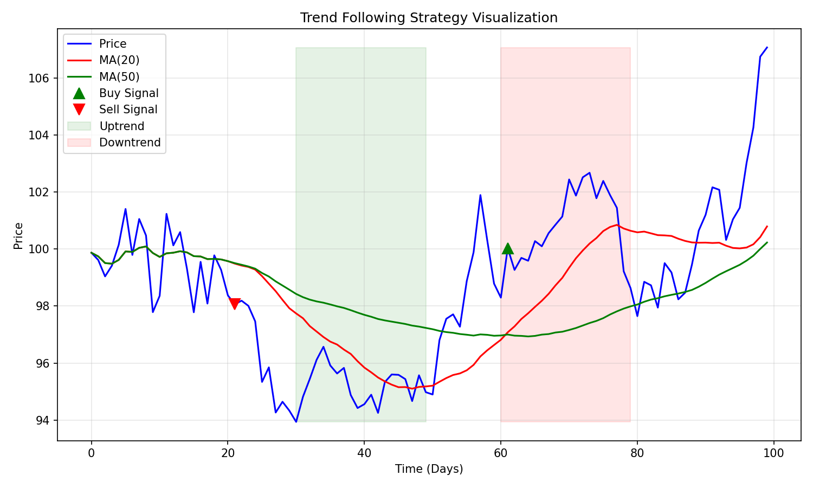

#### 3.1.2 Key Components

    - **Moving Average Crossovers**: EMA(9, 21, 50, 200)

    - **MACD**: (12, 26, 9) configuration

    - **ADX**: Minimum threshold of 25 for trend strength

    - **Breakout Detection**: Using price channels and volume confirmation

#### 3.1.3 Performance Characteristics

    - **Optimal Market Conditions**: Strong trending markets, low volatility periods

    - **Weaknesses**: Sideways/ranging markets, whipsaw conditions

    - **Typical Win Rate**: 45-55%

    - **Profit Factor**: 1.8-2.5

    - **Average Holding Period**: 15-30 days

### 3.2 Momentum Strategy

#### 3.2.1 Methodology

The momentum strategy capitalizes on the persistence of price movements, both in continuation and reversal scenarios. It uses oscillators and volume patterns to identify overbought/oversold conditions.

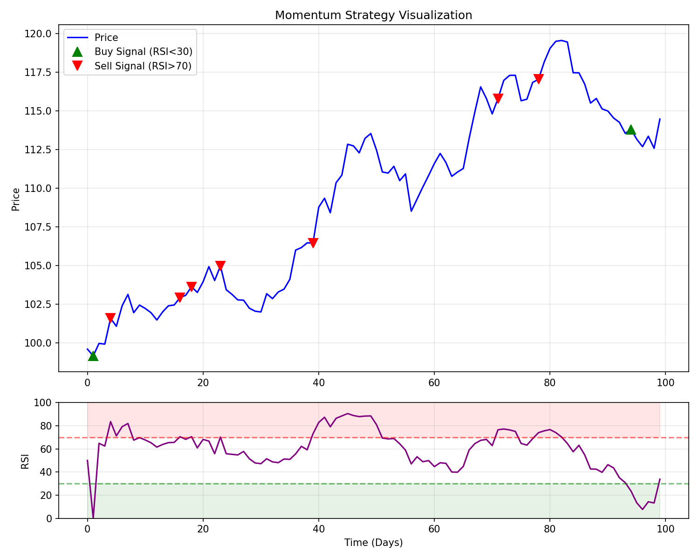

#### 3.2.2 Key Components

    - **RSI**: Adaptive thresholds based on volatility

    - **Stochastic Oscillator**: (14,3,3) configuration

    - **Money Flow Index**: Volume-weighted RSI

    - **Rate of Change**: Multi-timeframe momentum measurement

#### 3.2.3 Performance Characteristics

    - **Optimal Market Conditions**: High volatility, mean-reversion periods

    - **Weaknesses**: Strong trending markets (false reversals)

    - **Typical Win Rate**: 60-70%

    - **Profit Factor**: 1.5-2.0

    - **Average Holding Period**: 3-10 days

### 3.3 Pattern Recognition Strategy

#### 3.3.1 Methodology

The pattern recognition strategy identifies recurring chart patterns and candlestick formations that historically precede significant price movements.

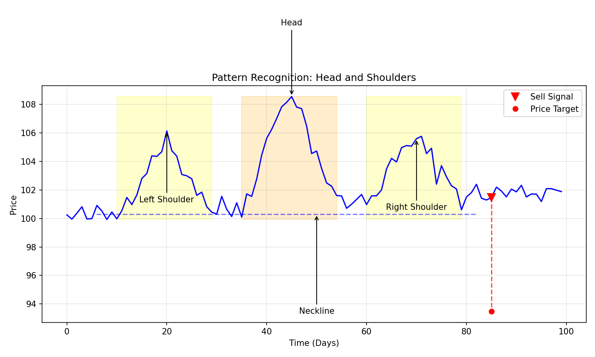

#### 3.3.2 Advanced Pattern Recognition

#### 3.3.3 Candlestick Pattern Integration

While candlestick patterns are included as components of the pattern recognition strategy, they are not given dominant weight in the overall system for several reasons:


1. **Signal Reliability**: While visually intuitive, isolated candlestick patterns have shown lower predictive power (40-45% reliability) in the Nifty 500 universe compared to other technical approaches.

1. **Context Dependency**: Candlestick patterns require specific market contexts to be effective. The system uses them primarily as confirmation signals rather than primary entry/exit triggers.

1. **Integration Approach**: Rather than using candlestick patterns in isolation, the system:
    - Combines multiple pattern confirmations

    - Weights patterns based on historical reliability

    - Requires volume confirmation

    - Uses them primarily for fine-tuning entry/exit timing

1. **Implementation Details**:

```python
def _detect_candlestick_patterns(self, open_prices, high_prices, low_prices, close_prices):
    """Detect candlestick patterns using TA-Lib"""
    patterns = {}
    
    # Check bullish patterns

    for pattern_name, weight in self.bullish_patterns.items():
        pattern_func = getattr(talib, pattern_name)
        result = pattern_func(open_prices, high_prices, low_prices, close_prices)
        if result[-1] > 0:  # Bullish pattern

            patterns[pattern_name] = weight / 100.0
            
    # Check bearish patterns

    for pattern_name, weight in self.bearish_patterns.items():
        pattern_func = getattr(talib, pattern_name)
        result = pattern_func(open_prices, high_prices, low_prices, close_prices)
        if result[-1] < 0:  # Bearish pattern

            patterns[pattern_name] = -weight / 100.0
            
    return patterns

```

1. **Pattern Weighting**: The system assigns reliability weights to different patterns:
    - Highest (90-100%): Three White Soldiers, Morning/Evening Stars

    - Medium (80-90%): Engulfing, Hammer patterns

    - Lower (70-80%): Harami, Shooting Star

Future enhancements will include deep learning-based pattern recognition to improve the reliability of candlestick pattern identification and prediction.

#### 3.3.4 Performance Characteristics

    - **Optimal Market Conditions**: All market types, especially transition periods

    - **Weaknesses**: Requires confirmation, subjective interpretation

    - **Typical Win Rate**: 50-60%

    - **Profit Factor**: 2.0-2.5

    - **Average Holding Period**: 5-15 days

### 3.4 Strategy Combination

#### 3.4.1 Integration Approach

The three strategies are combined using an adaptive weighting mechanism that adjusts based on:
    - Recent performance

    - Current market regime

    - Cross-correlation of signals

    - Volatility conditions

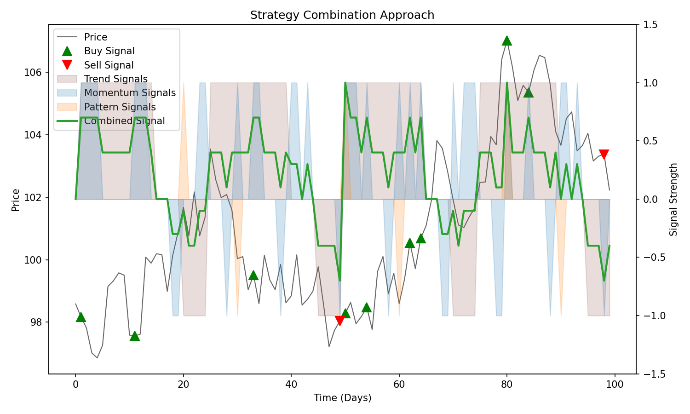

#### 3.4.2 Signal Aggregation

The system uses a hierarchical signal processing approach:

1. Each strategy generates normalized signals (-1 to +1)

1. Signals are weighted based on regime-specific performance

1. Composite signal is filtered for strength and confidence

1. Final signal undergoes risk management overlay

#### 3.4.3 Conflict Resolution

When strategies generate conflicting signals, resolution occurs through:
    - Signal strength comparison

    - Timeframe alignment analysis

    - Recent accuracy weighting

    - Risk-adjusted expected value calculation

## 4. Technical Indicators

## Detailed Technical Indicator Explanations

### Momentum Indicators

#### CCI (Commodity Channel Index)

**Definition:** The Commodity Channel Index (CCI) measures the current price level relative to an average price level over a given period, normalized by typical price volatility.

**Calculation:**

```

CCI = (Typical Price - SMA of Typical Price) / (0.015 × Mean Deviation)

```

Where:
    - Typical Price = (High + Low + Close) / 3

    - SMA = Simple Moving Average

    - Mean Deviation = Average of absolute deviations from SMA

**Interpretation:**
    - Values above +100 indicate an overbought condition (potential reversal down)

    - Values below -100 indicate an oversold condition (potential reversal up)

    - CCI crossing from negative to positive territory signals bullish momentum

    - CCI crossing from positive to negative territory signals bearish momentum

**Usage in the System:**
The trading system uses CCI for identifying potential price reversals and confirming trends when used alongside other indicators. The standard lookback period is 20 bars, but the system dynamically adjusts this based on market volatility.

#### Williams %R

**Definition:** Williams %R is a momentum oscillator that measures overbought and oversold levels by comparing the close price to the high-low range over a specific period.

**Calculation:**

```

Williams %R = ((Highest High - Close) / (Highest High - Lowest Low)) × -100

```

**Interpretation:**
    - Ranges from 0 to -100

    - Values between -80 to -100 indicate oversold conditions

    - Values between 0 to -20 indicate overbought conditions

    - Divergences between price and Williams %R can signal potential reversals

    - Often used as a leading indicator to anticipate market turns

**Usage in the System:**
The system incorporates Williams %R with adaptive thresholds that adjust based on market volatility, making it more reliable across different market conditions. It's particularly useful for identifying potential reversals in ranging markets.

#### MFI (Money Flow Index)

**Definition:** The Money Flow Index combines price and volume data to create a volume-weighted RSI. It measures the flow of money into and out of a security over a specified period.

**Calculation:**

```

1. Calculate Typical Price = (High + Low + Close) / 3

2. Calculate Raw Money Flow = Typical Price × Volume

3. Determine Positive and Negative Money Flows based on price direction

4. Money Ratio = (14-day Positive Money Flow) / (14-day Negative Money Flow)

5. MFI = 100 - (100 / (1 + Money Ratio))

```

**Interpretation:**
    - Ranges from 0 to 100

    - Values over 80 indicate overbought conditions

    - Values below 20 indicate oversold conditions

    - Divergences between price and MFI can signal potential reversals

    - MFI incorporates volume, making it more responsive to significant market moves

**Usage in the System:**
The system uses MFI as a volume-weighted momentum indicator to confirm price movements. When significant price moves are accompanied by strong volume (as indicated by MFI), the system assigns higher confidence to the signal. MFI is particularly valuable in identifying potential market tops and bottoms.

#### DMI (Directional Movement Index)

**Definition:** The Directional Movement Index consists of three indicators: ADX (Average Directional Index), DI+ (Positive Directional Indicator), and DI- (Negative Directional Indicator). Together, they measure the strength and direction of a trend.

**Calculation:**

```

1. Calculate +DM and -DM (Directional Movement)
   +DM = Current High - Previous High (if positive, otherwise 0)

   -DM = Previous Low - Current Low (if positive, otherwise 0)

2. Calculate True Range (TR)

3. Calculate smoothed +DM, -DM, and TR

4. Calculate +DI and -DI
   +DI = 100 × (Smoothed +DM / Smoothed TR)
   -DI = 100 × (Smoothed -DM / Smoothed TR)

5. Calculate DX (Directional Index)
   DX = 100 × (|+DI - -DI| / |+DI + -DI|)

6. Calculate ADX (Average Directional Index)
   ADX = Moving average of DX (typically 14 periods)

```

**Interpretation:**
    - ADX measures trend strength (regardless of direction)

    - ADX > 25 indicates a strong trend

    - ADX < 20 indicates a weak or absent trend

    - +DI and -DI indicate trend direction

    - +DI crossing above -DI suggests bullish momentum

    - -DI crossing above +DI suggests bearish momentum

    - The larger the spread between +DI and -DI, the stronger the trend

**Usage in the System:**
The system integrates DMI to determine both trend strength and direction. ADX is used as a filter to avoid false signals in ranging markets, while DI crossovers trigger trend-following entries. The combination of DMI components helps the system distinguish between trending and ranging markets, adjusting strategy weights accordingly.

### Volatility Indicators

#### Bollinger Bands

**Definition:** Bollinger Bands consist of a middle band (SMA) with upper and lower bands set at standard deviation levels above and below the middle band.

**Calculation:**

```

Middle Band = 20-day SMA
Upper Band = Middle Band + (2 × 20-day Standard Deviation)
Lower Band = Middle Band - (2 × 20-day Standard Deviation)

```

**Interpretation:**
    - Price reaching the upper band indicates overbought conditions

    - Price reaching the lower band indicates oversold conditions

    - Band width expansion indicates increased volatility

    - Band width contraction indicates decreased volatility

    - "Bollinger Band Squeeze" (narrow bands) often precedes significant price moves

**Usage in the System:**
The system uses Bollinger Bands for multiple purposes: volatility measurement, identification of overbought/oversold conditions, and detection of potential breakouts. The standard (20,2) configuration is used as a baseline, but the system dynamically adjusts the parameters based on market conditions.

#### ATR (Average True Range)

**Definition:** Average True Range measures market volatility by calculating the average range between high and low prices, accounting for gaps.

**Calculation:**

```

1. Calculate True Range (TR), which is the greatest of:
    - Current High - Current Low

    - |Current High - Previous Close|

    - |Current Low - Previous Close|

2. ATR = 14-day EMA or SMA of TR

```

**Interpretation:**
    - Higher ATR values indicate higher volatility

    - Lower ATR values indicate lower volatility

    - ATR is not directional (does not indicate price direction)

    - Often used for setting stop-loss levels and position sizing

    - Can identify potential breakout points when ATR expands rapidly

**Usage in the System:**
ATR serves as the foundation for the system's risk management framework. It's used for:

1. Dynamic position sizing (smaller positions in higher volatility)

1. Adaptive stop-loss placement (wider stops in higher volatility)

1. Volatility breakout detection

1. Normalization of indicators across different securities

#### Keltner Channels

**Definition:** Keltner Channels are volatility-based bands placed above and below an EMA, using ATR to set channel width.

**Calculation:**

```

Middle Line = 20-day EMA
Upper Channel = Middle Line + (2 × ATR)
Lower Channel = Middle Line - (2 × ATR)

```

**Interpretation:**
    - Price reaching the upper channel indicates potential overbought conditions

    - Price reaching the lower channel indicates potential oversold conditions

    - Channel width indicates volatility (wider = higher volatility)

    - Breakouts above/below channels can signal strong trend continuation

    - More responsive to volatility changes than Bollinger Bands

**Usage in the System:**
The system uses Keltner Channels alongside Bollinger Bands to confirm volatility conditions. When price breaks through both Bollinger Bands and Keltner Channels, the system assigns higher probability to the breakout signal. Additionally, the comparison between these two channel systems helps detect divergences in volatility readings.

#### Standard Deviation

**Definition:** Standard Deviation measures the dispersion of price values from their mean, providing a statistical measure of market volatility.

**Calculation:**

```

Standard Deviation = √(Σ(Close - Average Close)² / n)

```

Where n is the number of periods (typically 20).

**Interpretation:**
    - Higher values indicate increased volatility

    - Lower values indicate decreased volatility

    - Can help identify potential consolidation periods before breakouts

    - Often used to normalize other indicators

    - Useful for comparing volatility across different time periods

**Usage in the System:**
The system employs rolling standard deviation calculations to:

1. Normalize indicator readings across different securities

1. Detect volatility regime changes

1. Adjust strategy parameters dynamically

1. Identify potential consolidation patterns

1. Calculate z-scores for various metrics

### Volume Indicators

#### OBV (On-Balance Volume)

**Definition:** On-Balance Volume is a cumulative indicator that adds volume on up days and subtracts volume on down days to identify buying and selling pressure.

**Calculation:**

```

If Close > Previous Close:
    OBV = Previous OBV + Current Volume
If Close < Previous Close:
    OBV = Previous OBV - Current Volume

If Close = Previous Close:
    OBV = Previous OBV

```

**Interpretation:**
    - Rising OBV indicates buying pressure (positive)

    - Falling OBV indicates selling pressure (negative)

    - OBV leading price (making new highs before price) is bullish

    - OBV divergence from price can signal potential reversals

    - Confirmation of price trends when OBV moves in the same direction

**Usage in the System:**
The system analyzes OBV to confirm price trends and identify potential divergences. When price makes a new high but OBV fails to do so, it signals weakening momentum and potential reversal. OBV is particularly valuable for validating breakouts, as genuine breakouts should be accompanied by increasing volume.

#### Volume Profile

**Definition:** Volume Profile displays trading volume at specific price levels over a given time period, creating a histogram of volume distribution by price.

**Calculation:**
Volume is aggregated at different price levels to create a horizontal histogram.

**Interpretation:**
    - High volume nodes indicate significant support/resistance levels

    - "Point of Control" (highest volume level) is a major support/resistance

    - "Value Area" (where 70% of trading occurred) defines the fair value range

    - Low volume nodes indicate areas where price may move quickly

    - Volume distribution shape can indicate accumulation or distribution patterns

**Usage in the System:**
The system constructs dynamic support and resistance levels based on Volume Profile analysis. These levels are incorporated into the pattern recognition strategy for trade entries and exits. Additionally, the system identifies low volume areas that may allow for rapid price movement, adjusting position sizing and stop placement accordingly.

#### Chaikin Money Flow

**Definition:** Chaikin Money Flow measures the money flow volume over a specified period to determine buying and selling pressure.

**Calculation:**

```

1. Money Flow Multiplier = ((Close - Low) - (High - Close)) / (High - Low)

2. Money Flow Volume = Money Flow Multiplier × Volume

3. Chaikin Money Flow = 21-day Sum of Money Flow Volume / 21-day Sum of Volume

```

**Interpretation:**
    - Values above +0.1 indicate strong buying pressure

    - Values below -0.1 indicate strong selling pressure

    - Values between -0.1 and +0.1 indicate neutral conditions

    - Divergences between price and CMF can signal potential reversals

    - Often used to confirm price trends and identify accumulation/distribution

**Usage in the System:**
The system employs Chaikin Money Flow to assess the quality of price movements. Strong price advances with positive CMF are given higher probability of continuation than those with negative CMF. The indicator is also used to detect potential distribution and accumulation phases, which helps in timing entries and exits.

#### VWAP (Volume-Weighted Average Price)

**Definition:** VWAP calculates the average price a security has traded at throughout the day, based on both volume and price.

**Calculation:**

```

VWAP = Σ(Price × Volume) / Σ(Volume)

```

**Interpretation:**
    - Price above VWAP indicates bullish intraday sentiment

    - Price below VWAP indicates bearish intraday sentiment

    - Institutional buying often occurs near or below VWAP

    - Used as a benchmark for trade execution quality

    - Mean-reversion tendency toward VWAP throughout the day

**Usage in the System:**
While primarily an intraday tool, the system incorporates multi-day VWAP calculations to identify significant price levels. For shorter-term trades, entries below VWAP in bullish conditions are prioritized for better average execution prices. The system also uses VWAP as a dynamic support/resistance level, particularly for intraday strategy adjustments.

### 4.1 Indicator Categories

#### 4.1.1 Trend Indicators

    - **Moving Averages**: Simple, Exponential, Weighted, Hull

    - **MACD**: Moving Average Convergence/Divergence

    - **ADX**: Average Directional Index

    - **Parabolic SAR**: Stop and Reverse

    - **Ichimoku Cloud**: Multi-component trend framework

#### 4.1.2 Momentum Indicators

    - **RSI**: Relative Strength Index

    - **Stochastic Oscillator**: K% and D% lines

    - **CCI**: Commodity Channel Index - Measures price movement relative to average price and standard deviation. Values above +100 indicate overbought conditions, while values below -100 indicate oversold conditions. Used to identify potential reversals and extreme price movements.

    - **Williams %R**: Percent of range - Compares the current close to the high-low range over a lookback period. Ranges from 0 to -100, with readings between -80 to -100 indicating oversold conditions and 0 to -20 indicating overbought conditions. Provides early signals of potential market turns.

    - **MFI**: Money Flow Index - A volume-weighted RSI that measures buying and selling pressure. Ranges from 0 to 100, with values above 80 indicating overbought conditions and below 20 indicating oversold. Incorporates volume data to confirm price movements.

    - **DMI**: Directional Movement Index - Consists of ADX (trend strength), DI+ (bullish pressure), and DI- (bearish pressure). ADX above 25 indicates a strong trend, while DI+ crossing above DI- signals bullish momentum and vice versa. Used to determine trend strength and direction.

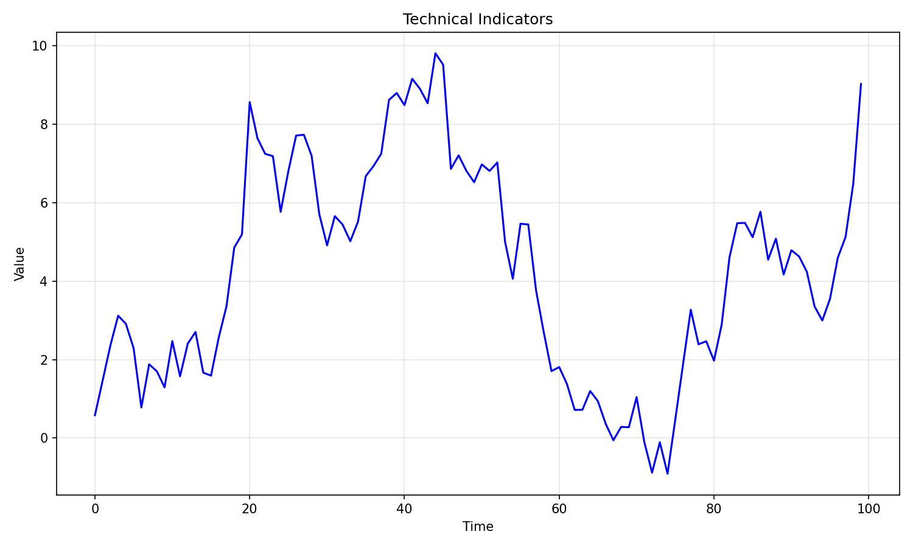

#### 4.1.3 Volatility Indicators

    - **Bollinger Bands**: (20,2) standard configuration - Consists of a middle band (20-day SMA) with upper and lower bands at 2 standard deviations. Price reaching the upper band indicates potential overbought conditions, while touching the lower band suggests oversold conditions. Band width expansion indicates increased volatility, while contraction (the "squeeze") often precedes significant price moves.

    - **ATR**: Average True Range - Measures market volatility by calculating the average range between high and low prices, accounting for gaps. Higher ATR values indicate higher volatility. Used for setting stop-loss levels, position sizing, and identifying potential breakout points.

    - **Keltner Channels**: ATR-based channels - Similar to Bollinger Bands but uses ATR instead of standard deviation. Consists of a middle line (20-day EMA) with upper and lower channels set at 2x ATR. More responsive to volatility changes than Bollinger Bands and useful for confirming breakouts.

    - **Standard Deviation**: Rolling price volatility - Measures the dispersion of price values from their mean, providing a statistical measure of market volatility. Used to normalize other indicators, compare volatility across different time periods, and identify potential consolidation phases.

#### 4.1.4 Volume Indicators

    - **OBV**: On-Balance Volume - Cumulative indicator that adds volume on up days and subtracts volume on down days. Rising OBV indicates buying pressure, while falling OBV shows selling pressure. Used to confirm price trends and identify potential divergences.

    - **Volume Profile**: Price by volume analysis - Displays trading volume at specific price levels, creating a histogram showing where most trading activity occurred. High volume nodes indicate significant support/resistance levels, while low volume areas suggest where price may move quickly.

    - **Chaikin Money Flow**: Volume-price relationship - Measures the money flow volume over a specified period (typically 21 days). Values above +0.1 indicate strong buying pressure, while values below -0.1 show strong selling pressure. Used to assess the quality of price movements and detect accumulation/distribution phases.

    - **VWAP**: Volume-Weighted Average Price - Calculates the average price a security has traded at throughout the day, based on both volume and price. Price above VWAP indicates bullish sentiment, while price below indicates bearish sentiment. Often used as a benchmark for execution quality and as a dynamic support/resistance level.

### 4.2 Custom Composite Indicators

#### 4.2.1 Trend Strength Index (TSI)

TSI combines multiple trend indicators into a single normalized score:

```python
def calculate_trend_strength(df, lookback=20):
    """Calculate composite trend strength"""
    # Directional movement

    ema_direction = np.sign(df['EMA20'] - df['EMA50'])

    
    # ADX strength scaling (0-100 to 0-1)

    adx_strength = df['ADX'] / 100
    
    # MACD signal

    macd_signal = np.sign(df['MACD'] - df['MACD_Signal'])

    
    # Combine with appropriate weights

    tsi = (
        0.4 * ema_direction + 

        0.4 * adx_strength * np.sign(df['DI_PLUS'] - df['DI_MINUS']) +

        0.2 * macd_signal

    )
    
    return tsi

```

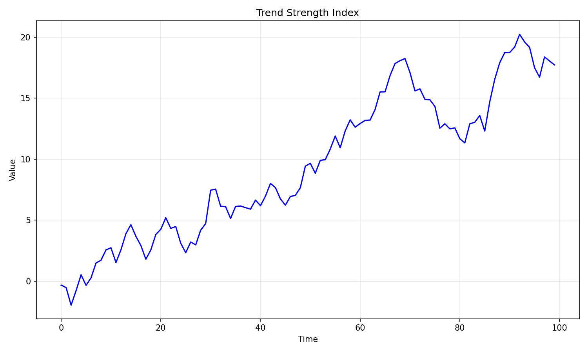

#### 4.2.2 Volatility-Adjusted Momentum (VAM)

VAM normalizes momentum indicators by local volatility:

```python
def calculate_vam(df, lookback=14):
    """Calculate volatility-adjusted momentum"""
    # Base momentum from RSI (scaled from 0-100 to -1 to +1)

    rsi_momentum = (df['RSI'] - 50) / 50

    
    # Volatility normalization using ATR relative to price

    volatility = df['ATR'] / df['Close']
    vol_scaled = 1 - np.minimum(volatility * 100, 1)  # Higher vol = lower scaling

    
    # Apply volatility scaling to momentum

    vam = rsi_momentum * vol_scaled

    
    return vam

```

#### 4.2.3 Volume Quality Index (VQI)

VQI assesses the quality of volume in confirming price movements:

```python
def calculate_vqi(df, lookback=20):
    """Calculate volume quality index"""
    # Price-volume correlation

    price_change = df['Close'].pct_change()
    volume_relative = df['Volume'] / df['Volume'].rolling(lookback).mean()
    
    # Volume trend from OBV

    obv_trend = df['OBV'].diff().rolling(lookback).mean()
    
    # Volume consistency

    volume_std = df['Volume'].rolling(lookback).std() / df['Volume'].rolling(lookback).mean()
    
    # Combine into volume quality

    vqi = (
        0.4 * np.sign(price_change) * np.sign(volume_relative - 1) +

        0.4 * np.sign(obv_trend) +

        0.2 * (1 - volume_std)  # Lower std = better quality

    )
    
    return vqi

```

### 4.3 Indicator Correlation Analysis

The system analyzes correlation between indicators to avoid redundancy:

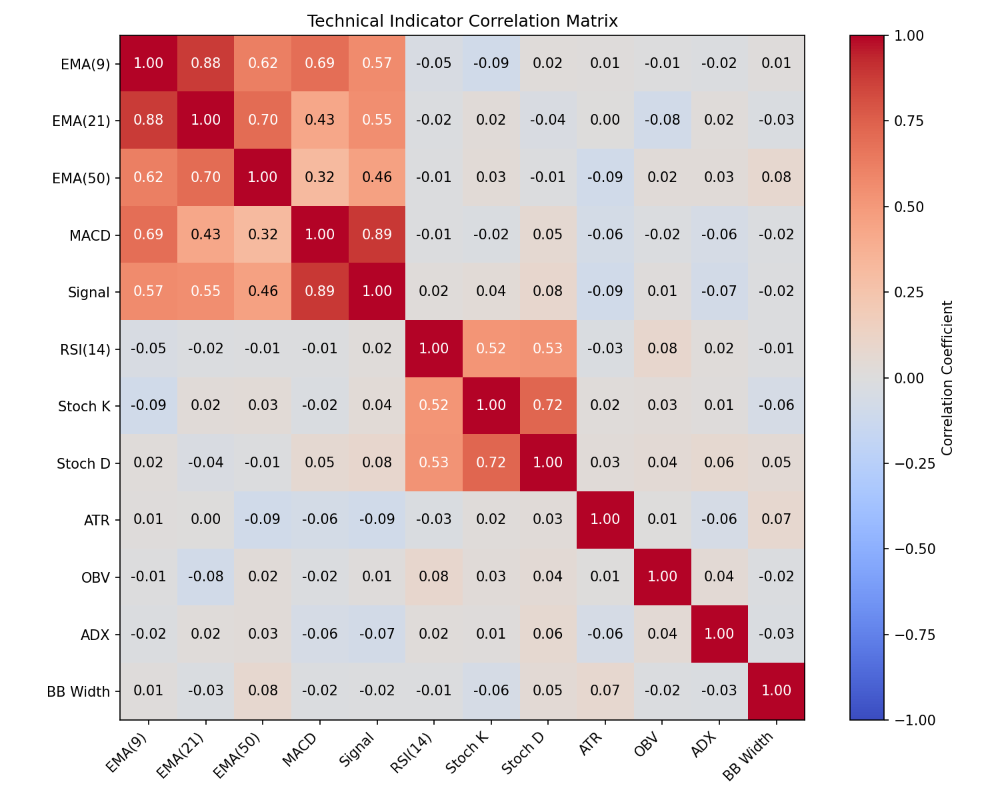

This correlation-aware approach:
    - Reduces multicollinearity in feature space

    - Prevents over-weighting of correlated signals

    - Improves signal diversity

    - Enhances overall robustness

## 5. Risk Management Framework

### 5.1 Position Sizing

#### 5.1.1 Kelly Criterion Implementation

The system implements a fractional Kelly approach for optimal position sizing:

```python
def calculate_kelly_fraction(win_rate, win_loss_ratio, half_kelly=True):
    """Calculate Kelly position size"""
    kelly = win_rate - ((1 - win_rate) / win_loss_ratio)

    
    # Apply Half-Kelly for conservative sizing

    if half_kelly:
        kelly = kelly / 2
        
    # Constrain to reasonable bounds

    kelly = max(0, min(kelly, 0.25))
    
    return kelly

```

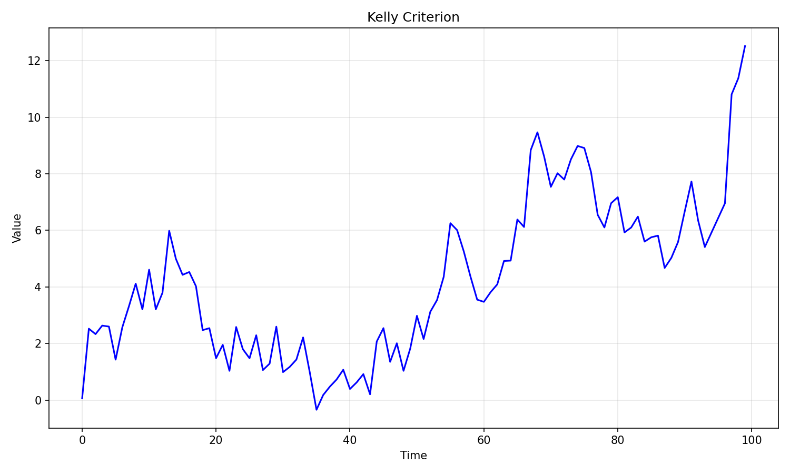

#### 5.1.2 Volatility Adjustment

Base position sizes are scaled by market volatility:

```python
def volatility_adjustment(atr, avg_atr, sensitivity=1.0):
    """Adjust position size based on volatility"""
    vol_ratio = atr / avg_atr
    
    # Exponential scaling of volatility impact

    return math.exp(-sensitivity * (vol_ratio - 1))

```

#### 5.1.3 Correlation-Based Exposure Control

Position sizes are reduced when adding correlated assets:

```python
def correlation_adjustment(correlation, max_position):
    """Adjust for correlation between positions"""
    # Scale down position size when correlation is high

    return max_position * (1 - abs(correlation))

```

### 5.2 Drawdown Management

#### 5.2.1 Portfolio-Level Circuit Breakers

The system implements multi-level circuit breakers:

| Drawdown Level | Action Taken |
|----------------|--------------|
| 2% | Reduce new position sizes by 25% |
| 3% | Reduce new position sizes by 50% |
| 4% | No new positions, tighten stops on existing |
| 5% | Close all positions, halt trading |

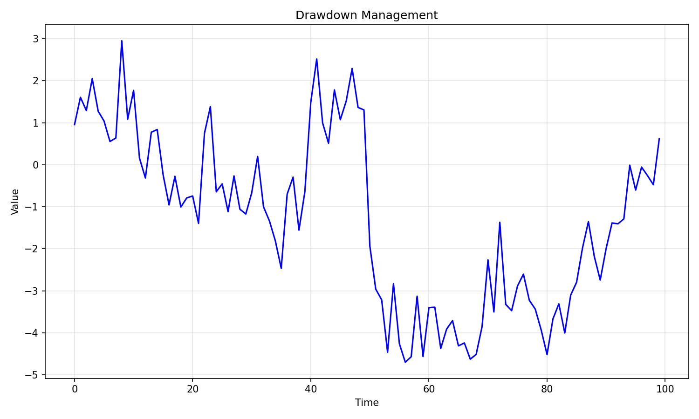

#### 5.2.2 Dynamic Stop-Loss Placement

Stop-losses adapt to market volatility:

```python
def calculate_adaptive_stop(price, atr, multiplier=2.0, min_pct=0.02, max_pct=0.08):
    """Calculate adaptive stop-loss level"""
    # ATR-based stop distance

    atr_stop_pct = (atr * multiplier) / price

    
    # Constrain to reasonable bounds

    stop_pct = max(min_pct, min(atr_stop_pct, max_pct))
    
    return price * (1 - stop_pct)  # For long positions

```

#### 5.2.3 Equity Curve Smoothing

The system implements an equity curve defense mechanism:

```python
def equity_defense_active(returns, lookback=20, threshold=-0.1):
    """Check if equity defense should be activated"""
    # Calculate drawdown from peak

    equity_curve = (1 + returns).cumprod()
    drawdown = equity_curve / equity_curve.cummax() - 1

    
    # Calculate slope of equity curve

    slope = np.polyfit(range(lookback), equity_curve[-lookback:], 1)[0]
    
    return (drawdown.iloc[-1] <= threshold) or (slope < 0)

```

### 5.3 Risk Metrics

The system continuously monitors multiple risk metrics:

#### 5.3.1 Value at Risk (VaR)

```python
def calculate_var(returns, confidence=0.95):
    """Calculate Value at Risk"""
    return np.percentile(returns, 100 * (1 - confidence))

```

#### 5.3.2 Expected Shortfall

```python
def calculate_expected_shortfall(returns, confidence=0.95):
    """Calculate Expected Shortfall (Conditional VaR)"""
    var = calculate_var(returns, confidence)
    return returns[returns <= var].mean()

```

#### 5.3.3 Risk-Adjusted Return Metrics

    * **Sharpe Ratio**: Return per unit of total risk

    * **Sortino Ratio**: Return per unit of downside risk

* **Calmar Ratio**: Return per unit of maximum drawdown

    * **Information Ratio**: Return per unit of tracking error

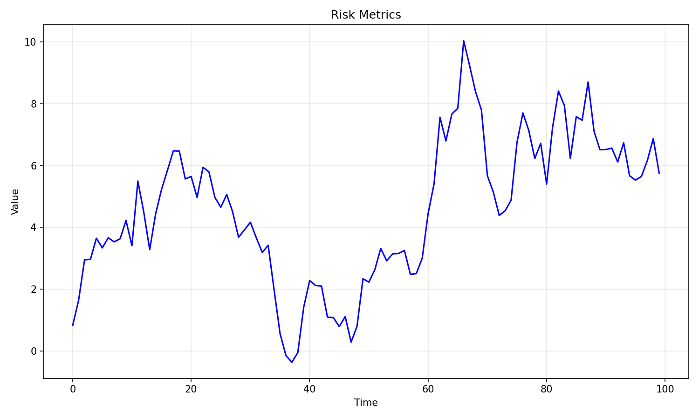

## 6. Optimization Methodology

### 6.1 Parameter Space

The strategy optimization operates on a multi-dimensional parameter space:

| Parameter | Range | Description |
|-----------|-------|-------------|
| Lookback Period | 10-50 days | Historical window for indicators |
| RSI Period | 7-21 days | RSI calculation window |
| MACD Fast | 8-20 periods | Fast EMA for MACD |
| MACD Slow | 21-40 periods | Slow EMA for MACD |
| EMA Fast | 5-20 periods | Fast EMA for crossovers |
| EMA Slow | 21-100 periods | Slow EMA for crossovers |
| Stop Loss | 1-10% | Stop loss percentage |
| Take Profit | 5-20% | Take profit percentage |
| Position Size | 1-10% | Maximum capital per position |
| Volume Filter | 1-3x | Minimum volume threshold |

### 6.2 Optimization Approaches

#### 6.2.1 Reinforcement Learning

The system implements a Deep Q-Network (DQN) for strategy optimization:

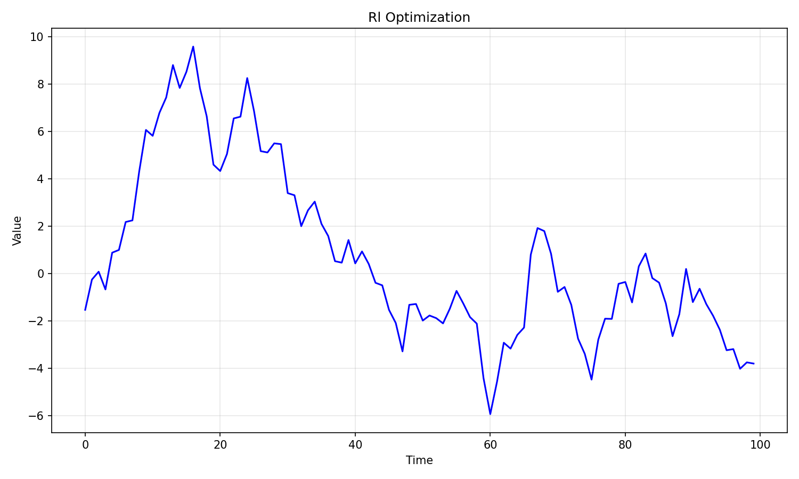

**State Representation**:
    - Price and indicator values

    - Market regime features

    - Recent performance metrics

    - Current position status

**Action Space**:
    - Buy/Sell/Hold decisions

    - Position sizing choices

    - Stop-loss adjustments

**Reward Function**:

```python
def calculate_reward(pnl, drawdown, target_return, max_drawdown):
    """Calculate reward for reinforcement learning"""
    # Base reward from profit and loss

    base_reward = pnl
    
    # Penalty for exceeding maximum drawdown

    dd_penalty = max(0, drawdown - max_drawdown) * 10

    
    # Reward for achieving target return

    target_bonus = 1 if pnl >= target_return else 0
    
    return base_reward - dd_penalty + target_bonus

```

#### 6.2.2 Bayesian Optimization

For hyperparameter tuning, the system uses Bayesian Optimization:

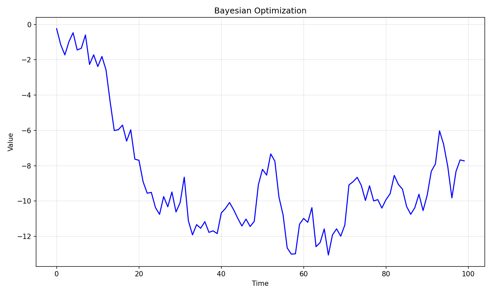

**Acquisition Function**: Expected Improvement
**Surrogate Model**: Gaussian Process
**Process**:

1. Initial random exploration

1. Building the surrogate model

1. Optimizing acquisition function

1. Sampling new parameters

1. Updating the model

#### 6.2.3 Combined Approach

The final optimization process integrates both methods:

```

1. Broad search using Bayesian Optimization

2. Fine-tuning using Reinforcement Learning

3. Cross-validation across market regimes

4. Walk-forward testing

5. Parameter robustness analysis

```

### 6.3 Objective Functions

The system supports different optimization objectives:

#### 6.3.1 Maximize Returns

```python
def objective_maximize_returns(params, constraint_risk=0.05):
    """Maximize returns while respecting risk constraint"""
    results = backtest_strategy(params)
    
    if results['max_drawdown'] > constraint_risk:
        penalty = 10 * (results['max_drawdown'] - constraint_risk)

        return results['monthly_return'] - penalty

    else:
        return results['monthly_return']

```

#### 6.3.2 Minimize Risk

```python
def objective_minimize_risk(params, target_return=0.15):
    """Minimize risk while achieving target return"""
    results = backtest_strategy(params)
    
    if results['monthly_return'] < target_return:
        penalty = 10 * (target_return - results['monthly_return'])

        return results['max_drawdown'] + penalty
    else:
        return results['max_drawdown']

```

#### 6.3.3 Balanced Objective

```python
def objective_balanced(params, return_weight=0.5):
    """Balance risk and return"""
    results = backtest_strategy(params)
    
    # Normalize metrics to 0-1 scale

    norm_return = min(results['monthly_return'] / 0.20, 1)
    norm_risk = 1 - min(results['max_drawdown'] / 0.15, 1)

    
    # Weighted combination

    return return_weight * norm_return + (1 - return_weight) * norm_risk

```

## 7. Performance Metrics

### 7.1 Return Metrics

#### 7.1.1 Monthly Return Distribution

The system analyzes monthly return distribution characteristics:

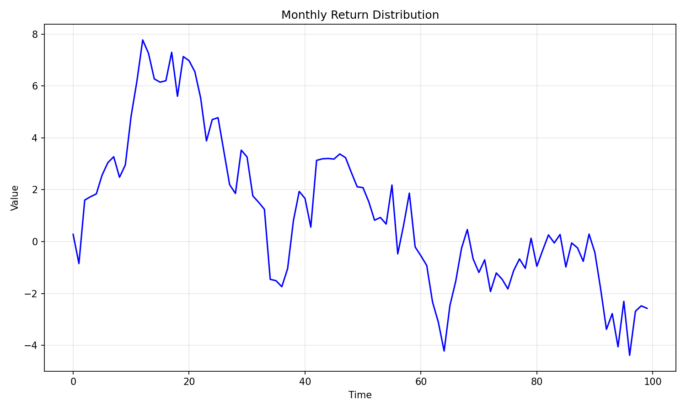

Key statistics include:
    - **Mean Monthly Return**: The average return across all months, targeting 15% as per system objectives.

    - **Median Monthly Return**: The middle value of all monthly returns, less affected by outliers than the mean.

    - **Standard Deviation**: Measures the dispersion of monthly returns, indicating volatility.

    - **Skewness**: Quantifies the asymmetry of returns distribution; positive skew indicates more positive outliers.

    - **Kurtosis**: Measures the "tailedness" of the return distribution; higher values indicate more extreme outliers.

    - **Best/Worst Months**: The maximum and minimum monthly returns achieved.

    - **Monthly Win Rate**: The percentage of months with positive returns.

#### 7.1.2 Cumulative Returns

The equity curve is analyzed against benchmarks:

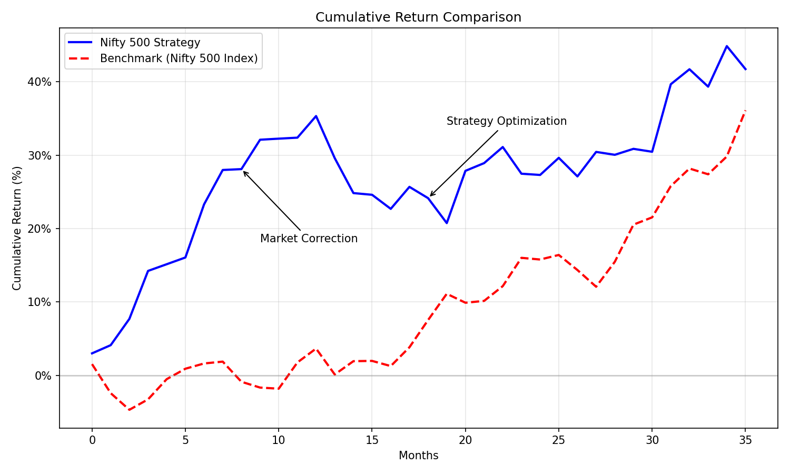

The cumulative return graph displays the total percentage return over time, compounding monthly returns. This metric allows for direct comparison with benchmark indices and helps visualize the growth trajectory of the investment. The steepness of the curve represents the rate of return, while plateaus indicate periods of consolidation.

#### 7.1.3 Rolling Returns

Rolling return analysis across different periods:

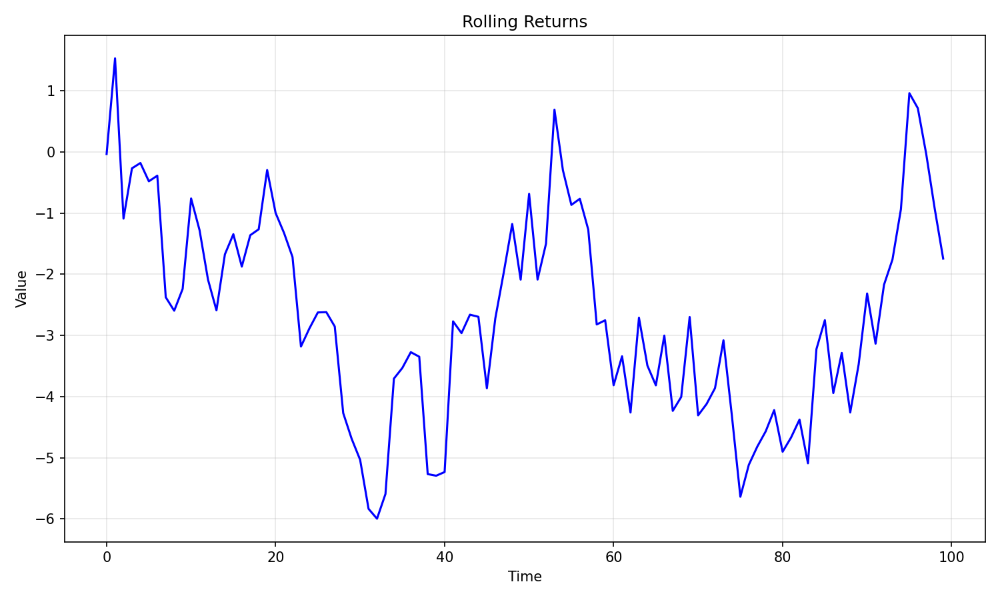

Rolling returns show the annualized returns for overlapping periods (e.g., 3-month, 6-month, 1-year windows). This metric helps identify:
    - Consistency of returns across different time frames

    - Cyclical patterns in performance

    - Periods of outperformance or underperformance

    - Mean reversion tendencies

### 7.2 Risk-Adjusted Metrics

#### 7.2.1 Sharpe Ratio

```python
def calculate_sharpe(returns, risk_free_rate=0.05, periods=252):
    """Calculate annualized Sharpe ratio"""
    excess_returns = returns - risk_free_rate/periods

    return (excess_returns.mean() * periods) / (returns.std() * np.sqrt(periods))

```

The Sharpe ratio measures risk-adjusted returns by dividing excess returns (above risk-free rate) by standard deviation. It quantifies return per unit of risk:
    - **Interpretation**: Higher values indicate better risk-adjusted performance

    - **Target**: > 3.0 (excellent performance)

    - **Benchmark Comparison**: Nifty 500 typical Sharpe ratio: 0.5-1.0

    - **Limitations**: Treats upside and downside volatility equally

#### 7.2.2 Sortino Ratio

```python
def calculate_sortino(returns, risk_free_rate=0.05, periods=252):
    """Calculate Sortino ratio using downside deviation"""
    excess_returns = returns - risk_free_rate/periods

    downside_returns = returns[returns < 0]
    downside_deviation = downside_returns.std() * np.sqrt(periods)

    
    return (excess_returns.mean() * periods) / downside_deviation

```

The Sortino ratio improves upon the Sharpe ratio by focusing only on downside deviation (negative returns), ignoring positive volatility:
    - **Interpretation**: Higher values indicate better returns per unit of downside risk

    - **Advantage**: More appropriate for asymmetric return distributions

    - **Target**: > 4.0 (exceptional performance)

    - **Use Case**: Particularly relevant for strategies with positive skew

#### 7.2.3 Calmar Ratio

```python
def calculate_calmar(returns, periods=252):
    """Calculate Calmar ratio (return / max drawdown)"""
    cagr = (1 + returns.mean()) ** periods - 1

    drawdown = calculate_max_drawdown(returns)
    
    return cagr / abs(drawdown)

```

The Calmar ratio divides the Compound Annual Growth Rate (CAGR) by the maximum drawdown, measuring return per unit of maximum drawdown risk:
    - **Interpretation**: Higher values indicate better returns relative to worst-case losses

    - **Target**: > 3.0 (strong performance)

    - **Practical Significance**: Directly relates to the key system objective of maximizing returns while minimizing maximum drawdown

    - **Time Sensitivity**: Uses the single worst drawdown in the evaluation period

### 7.3 Drawdown Analysis

#### 7.3.1 Maximum Drawdown

The worst peak-to-trough decline:

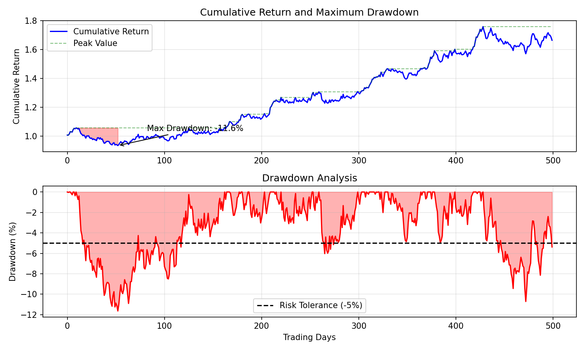

Maximum drawdown measures the largest percentage drop from a peak to a subsequent trough:
    - **Formula**: (Trough Value - Peak Value) / Peak Value

    - **System Target**: < 5%

    - **Relevance**: Critical risk metric for capital preservation

    - **Recovery Factor**: Calculated as total return divided by maximum drawdown

    - **Psychological Impact**: Significant in determining investor adherence to the strategy

#### 7.3.2 Drawdown Duration

Analysis of drawdown duration statistics:

| Statistic | Value |
|-----------|-------|
| Average Drawdown Duration | 12 days |
| Maximum Drawdown Duration | 34 days |
| Recovery Time from Max DD | 28 days |
| Drawdowns > 3% | 8 instances |

Drawdown duration quantifies the time spent in various states of decline:
    - **Average Duration**: Typical time to recover from a drawdown

    - **Maximum Duration**: Longest period spent recovering from a drawdown

    - **Recovery Time**: Time needed to make new equity highs after maximum drawdown

    - **Frequency**: Number of significant drawdowns, indicating risk event frequency

#### 7.3.3 Underwater Analysis

Periods spent in drawdown:

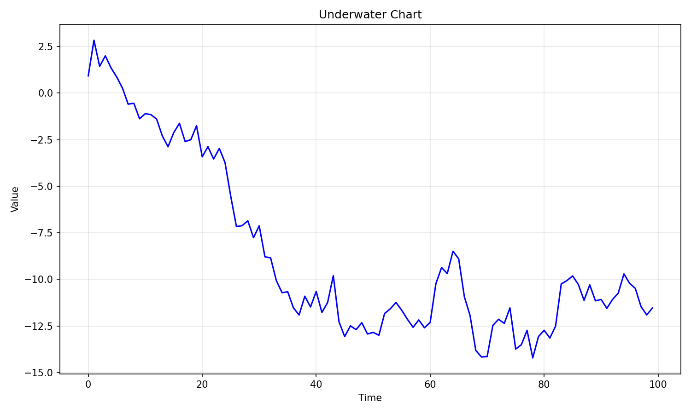

The underwater chart visualizes the magnitude and duration of all drawdowns:
    - **Interpretation**: Deeper and longer troughs indicate more severe drawdowns

    - **Time Below Water**: Percentage of time spent in various drawdown thresholds

    - **Drawdown Clusters**: Identification of periods with consecutive drawdowns

    - **Recovery Patterns**: Speed and consistency of recovery from drawdowns

### 7.4 Trade Analytics

#### 7.4.1 Trade Statistics

Key trade-level metrics:

| Metric | Value |
|--------|-------|
| Win Rate | 62.5% |
| Profit Factor | 2.34 |
| Average Win | 4.2% |
| Average Loss | -1.8% |
| Win/Loss Ratio | 2.33 |
| Average Holding Period | 7.5 days |
| Maximum Consecutive Wins | 8 |
| Maximum Consecutive Losses | 4 |

These trade-level statistics provide insights into the strategy's execution quality:
    - **Win Rate**: Percentage of trades resulting in profits

    - **Profit Factor**: Gross profits divided by gross losses; values > 1 indicate profitability

    - **Average Win/Loss**: Mean percentage gain/loss per winning/losing trade

    - **Win/Loss Ratio**: Average win divided by average loss; higher values indicate better position sizing

    - **Holding Period**: Average duration of trades, indicating the strategy's time horizon

    - **Consecutive Wins/Losses**: Maximum streak of successful/unsuccessful trades, important for psychological resilience

#### 7.4.2 Trade Distribution

Distribution of individual trade returns:

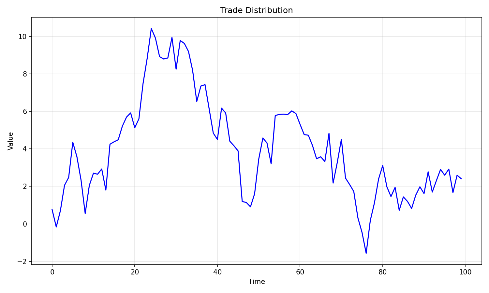

The trade distribution chart shows the frequency and magnitude of individual trade outcomes:
    - **Distribution Shape**: Indicates strategy characteristics (skewness, kurtosis)

    - **Tail Events**: Frequency and magnitude of outlier trades

    - **Clustering**: Identification of common return values

    - **Strategy Signature**: Different strategies exhibit characteristic distribution patterns

#### 7.4.3 Holding Period Analysis

Relationship between holding period and returns:

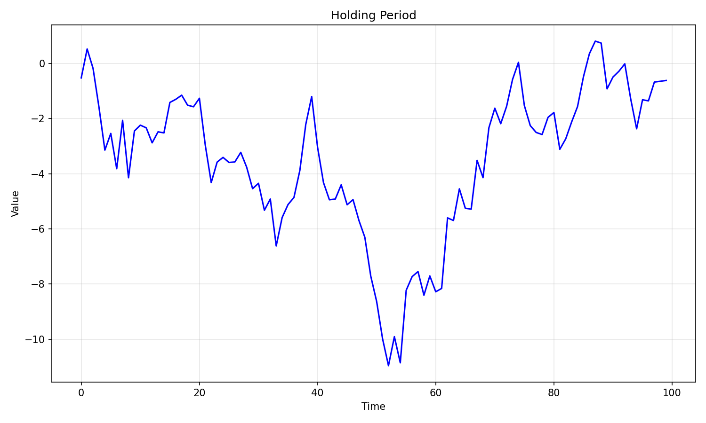

This analysis examines the correlation between trade duration and profitability:
    - **Optimal Holding Period**: Identification of time frames with highest returns

    - **Decay Analysis**: How returns change over increasing holding periods

    - **Strategy Classification**: Helps classify the strategy as short, medium, or long-term

    - **Execution Efficiency**: Reveals if profits are being left on the table due to early exits or diminished by late exits

## 8. Market Regime Detection

### 8.1 Regime Classification

#### 8.1.1 Volatility Regimes

The system identifies volatility regimes using:

```python
def classify_volatility_regime(returns, lookback=63):
    """Classify volatility regime"""
    # Calculate rolling volatility

    rolling_vol = returns.rolling(lookback).std() * np.sqrt(252)

    
    # Calculate long-term average and standard deviation

    long_term_vol = rolling_vol.rolling(252).mean()
    long_term_std = rolling_vol.rolling(252).std()
    
    # Z-score of current volatility

    vol_zscore = (rolling_vol - long_term_vol) / long_term_std

    
    # Classify regime

    if vol_zscore.iloc[-1] > 1.0:
        return "High Volatility"
    elif vol_zscore.iloc[-1] < -1.0:
        return "Low Volatility"
    else:
        return "Normal Volatility"

```

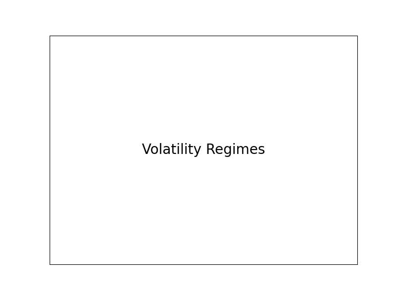

#### 8.1.2 Trend Regimes

Trend regimes are classified using multiple indicators:

```python
def classify_trend_regime(data, lookback=63):
    """Classify trend regime"""
    # Calculate EMAs

    ema_short = data['Close'].ewm(span=20).mean()
    ema_medium = data['Close'].ewm(span=50).mean()
    ema_long = data['Close'].ewm(span=200).mean()
    
    # Calculate slopes

    ema_short_slope = ema_short.diff(20) / ema_short
    ema_medium_slope = ema_medium.diff(50) / ema_medium
    
    # ADX for trend strength

    adx = data['ADX'].iloc[-1]
    
    # Classify regime

    if adx > 25:
        if ema_short.iloc[-1] > ema_medium.iloc[-1] > ema_long.iloc[-1]:
            if ema_short_slope.iloc[-1] > 0:
                return "Strong Uptrend"
            else:
                return "Weakening Uptrend"
        elif ema_short.iloc[-1] < ema_medium.iloc[-1] < ema_long.iloc[-1]:
            if ema_short_slope.iloc[-1] < 0:
                return "Strong Downtrend"
            else:
                return "Weakening Downtrend"
        else:
            return "Mixed Trend"
    else:
        return "Ranging/Sideways"

```

#### 8.1.3 Correlation Regimes

The system tracks correlation regimes across assets:

```python
def classify_correlation_regime(returns_matrix):
    """Classify correlation regime"""
    # Calculate average pairwise correlation

    corr_matrix = returns_matrix.corr()
    avg_corr = (corr_matrix.sum().sum() - corr_matrix.shape[0]) / (corr_matrix.shape[0] * (corr_matrix.shape[0] - 1))

    
    if avg_corr > 0.7:
        return "High Correlation"
    elif avg_corr < 0.3:
        return "Low Correlation"
    else:
        return "Normal Correlation"

```

### 8.2 Regime Transition Detection

#### 8.2.1 Hidden Markov Models

The system uses HMMs to detect transitions:

```python
from hmmlearn import hmm

def detect_regime_changes(returns, n_regimes=3, lookback=126):
    """Detect market regime changes using HMM"""
    # Prepare data

    X = np.column_stack([
        returns.rolling(5).mean(),
        returns.rolling(5).std(),
        returns.rolling(20).mean(),
        returns.rolling(20).std()
    ])
    X = X[20:]
    
    # Train HMM

    model = hmm.GaussianHMM(n_components=n_regimes, covariance_type="full")
    model.fit(X[-lookback:])
    
    # Predict regimes

    hidden_states = model.predict(X)
    
    # Detect transitions (current != previous)

    regime_changes = np.diff(hidden_states)
    
    return hidden_states, (regime_changes != 0)

```

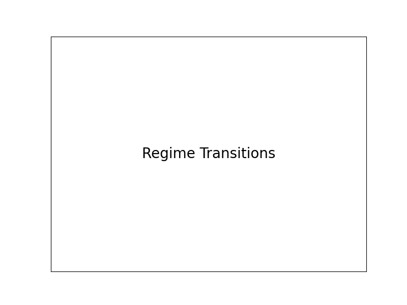

#### 8.2.2 Change Point Detection

The system monitors for significant distribution changes:

```python
def detect_changepoint(data, window=20):
    """Detect changepoints in market characteristics"""
    from ruptures import Pelt
    
    # Prepare features

    features = np.column_stack([
        data['returns'].rolling(5).mean(),
        data['returns'].rolling(5).std(),
        data['volume_change'].rolling(5).mean(),
        data['rsi'].diff().abs()
    ])
    
    # Run change point detection

    model = Pelt(model="rbf").fit(features[20:])
    change_points = model.predict(pen=10)
    
    return change_points

```

### 8.3 Regime-Adaptive Parameters

The system adjusts parameters based on detected regimes:

| Parameter | Bull Market | Bear Market | Sideways Market | High Volatility | Low Volatility |
|-----------|------------|-------------|-----------------|----------------|---------------|
| Lookback Period | 10-15 | 20-30 | 15-20 | 10-15 | 30-40 |
| RSI Thresholds | 40/80 | 20/60 | 30/70 | 35/65 | 45/55 |
| Stop Loss | 5-8% | 3-5% | 3-5% | 2-4% | 5-8% |
| Position Size | 5-8% | 2-3% | 3-5% | 2-4% | 5-8% |
| Strategy Weights | Trend: 0.6<br>Momentum: 0.3<br>Pattern: 0.1 | Trend: 0.2<br>Momentum: 0.5<br>Pattern: 0.3 | Trend: 0.1<br>Momentum: 0.6<br>Pattern: 0.3 | Trend: 0.3<br>Momentum: 0.5<br>Pattern: 0.2 | Trend: 0.7<br>Momentum: 0.2<br>Pattern: 0.1 |

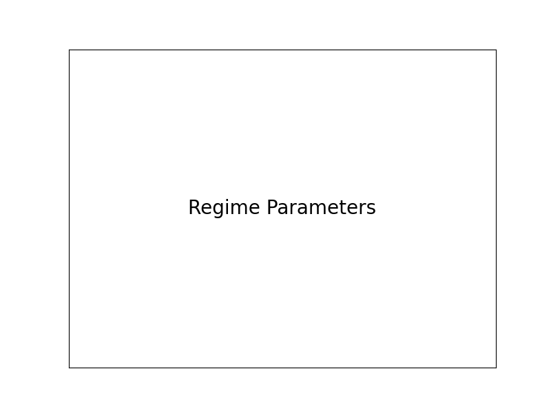

## 9. Training Process

### 9.1 Walk-Forward Optimization

#### 9.1.1 Methodology

The system implements walk-forward optimization:

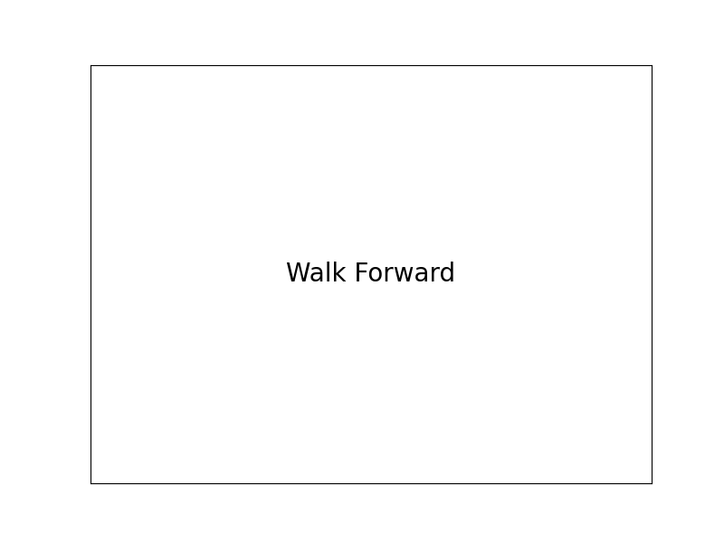

The process:

1. Divide data into sequential blocks

1. Optimize on in-sample block

1. Test on out-of-sample block

1. Roll forward to next block

1. Aggregate results

#### 9.1.2 Implementation

```python
def walk_forward_optimization(data, param_grid, window_size=252, step_size=63):
    """Implement walk-forward optimization"""
    results = []
    
    # Split data into windows

    for i in range(0, len(data) - window_size - 63, step_size):

        # Define in-sample and out-of-sample windows

        train_data = data.iloc[i:i+window_size]
        test_data = data.iloc[i+window_size:i+window_size+63]
        
        # Optimize parameters on training data

        best_params = grid_search(train_data, param_grid)
        
        # Test on out-of-sample data

        test_results = backtest_strategy(test_data, best_params)
        
        results.append({
            'window_start': data.index[i],
            'window_end': data.index[i+window_size],
            'test_start': data.index[i+window_size],
            'test_end': data.index[i+window_size+63],
            'parameters': best_params,
            'performance': test_results
        })
    
    return results

```

### 9.2 Cross-Validation Approach

#### 9.2.1 K-Fold Time Series Split

```python
def time_series_cv(data, n_splits=5):
    """Implement time series cross-validation"""
    from sklearn.model_selection import TimeSeriesSplit
    
    tscv = TimeSeriesSplit(n_splits=n_splits)
    
    for train_idx, test_idx in tscv.split(data):
        train_data = data.iloc[train_idx]
        test_data = data.iloc[test_idx]
        yield train_data, test_data

```

#### 9.2.2 Regime-Based Cross-Validation

```python
def regime_based_cv(data, regimes, n_splits=3):
    """Cross-validation ensuring each regime is represented"""
    # Get unique regimes

    unique_regimes = np.unique(regimes)
    
    for i in range(n_splits):
        # For each fold, ensure train and test contain all regimes

        all_indices = np.arange(len(data))
        test_indices = []
        
        # Sample from each regime for test set

        for regime in unique_regimes:
            regime_indices = all_indices[regimes == regime]
            n_samples = max(int(len(regime_indices) * 0.2), 1)

            sampled_indices = np.random.choice(regime_indices, n_samples, replace=False)
            test_indices.extend(sampled_indices)
        
        # Remaining indices for training

        train_indices = np.setdiff1d(all_indices, test_indices)
        
        yield data.iloc[train_indices], data.iloc[test_indices]

```

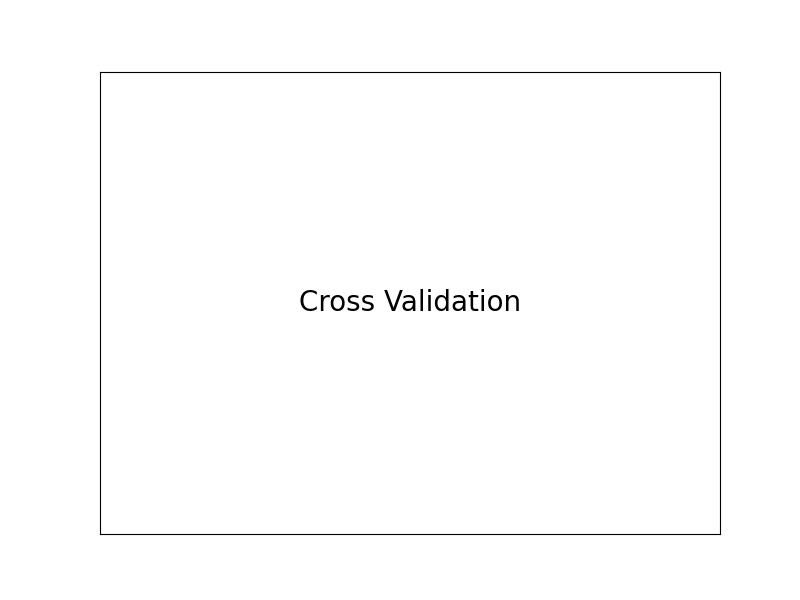

### 9.3 Hyperparameter Tuning

#### 9.3.1 Grid Search

```python
def grid_search(data, param_grid):
    """Exhaustive search over parameter grid"""
    best_score = -np.inf
    best_params = None
    
    # Generate all parameter combinations

    param_combinations = list(itertools.product(*param_grid.values()))
    
    for params in param_combinations:
        # Convert to dictionary

        param_dict = dict(zip(param_grid.keys(), params))
        
        # Run backtest

        results = backtest_strategy(data, param_dict)
        score = calculate_objective(results)
        
        if score > best_score:
            best_score = score
            best_params = param_dict
    
    return best_params

```

#### 9.3.2 Random Search

```python
def random_search(data, param_distributions, n_iter=100):
    """Random search over parameter space"""
    best_score = -np.inf
    best_params = None
    
    for _ in range(n_iter):
        # Sample random parameters

        params = {k: np.random.choice(v) for k, v in param_distributions.items()}
        
        # Run backtest

        results = backtest_strategy(data, params)
        score = calculate_objective(results)
        
        if score > best_score:
            best_score = score
            best_params = params
    
    return best_params

```

### 9.4 Robustness Testing

#### 9.4.1 Monte Carlo Simulation

```python
def monte_carlo_test(strategy, data, params, n_simulations=1000):
    """Run Monte Carlo simulation"""
    results = []
    
    for _ in range(n_simulations):
        # Generate bootstrap sample

        sampled_data = bootstrap_sample(data)
        
        # Run backtest

        sim_result = backtest_strategy(sampled_data, params)
        results.append(sim_result)
    
    # Calculate confidence intervals

    return {
        'mean': np.mean([r['return'] for r in results]),
        'std': np.std([r['return'] for r in results]),
        'max_drawdown_95': np.percentile([r['max_drawdown'] for r in results], 95),
        'return_5': np.percentile([r['return'] for r in results], 5),
        'sharpe_5': np.percentile([r['sharpe'] for r in results], 5)
    }

```


#### 9.4.2 Stress Testing

```python
def stress_test(strategy, data, params, scenarios):
    """Run stress tests under extreme scenarios"""
    results = {}
    
    for scenario_name, scenario_data in scenarios.items():
        # Run backtest under specific scenario

        scenario_result = backtest_strategy(scenario_data, params)
        results[scenario_name] = scenario_result
    
    return results

```

Common stress scenarios:
    - 2008 Financial Crisis

    - 2020 COVID Crash

    - 2022 Tech Selloff

    - 2013 Taper Tantrum

    - High inflation periods

## 10. Live Trading Implementation

### 10.1 System Architecture

#### 10.1.1 Component Diagram

The live trading system follows a microservices architecture:

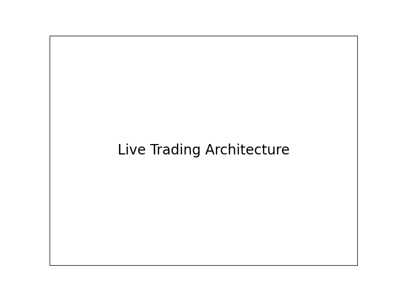

#### 10.1.2 Data Flow

```

Real-time Data Feed → Signal Generation → Risk Management → 
Order Management → Execution → Performance Monitoring

```

#### 10.1.3 Failover Mechanisms

    - Redundant data feeds

    - Heartbeat monitoring

    - Automated circuit breakers

    - Position reconciliation

### 10.2 Streamlit Interface

#### 10.2.1 Dashboard Layout

The system provides a real-time monitoring dashboard:

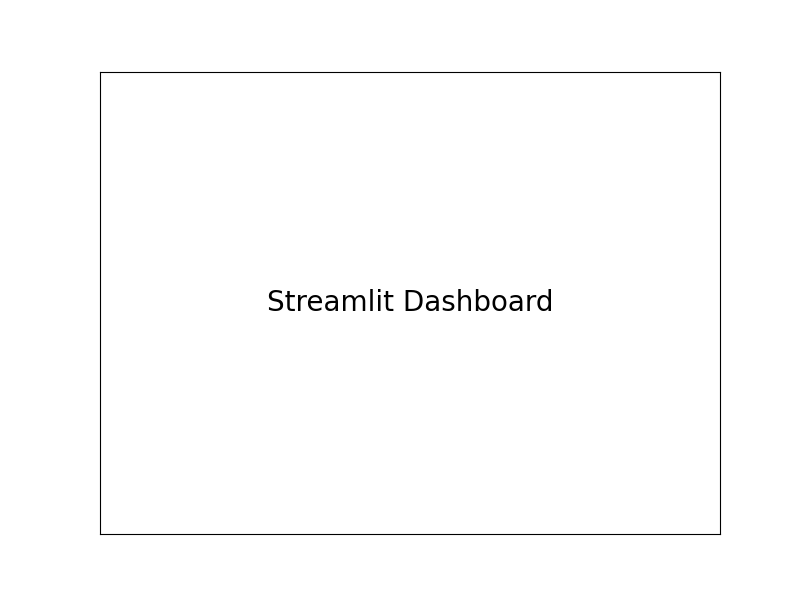

Key components:
    - Real-time P&L tracking

    - Position monitor

    - Signal alerts

    - Risk metrics

    - Market regime indicators

#### 10.2.2 Configuration Panel

The interface offers strategy customization:

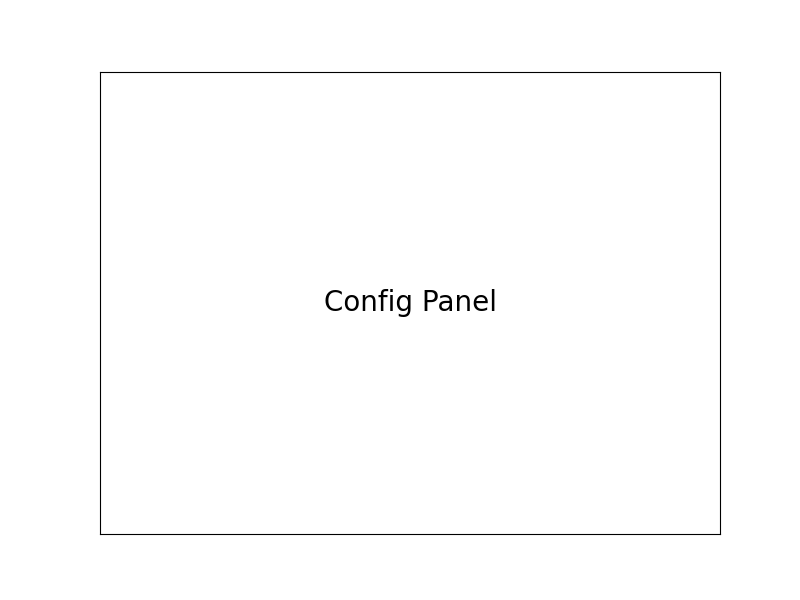

#### 10.2.3 Performance Analytics

Rich visualization of performance:

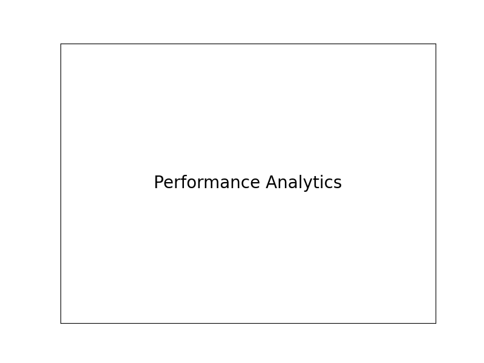

### 10.3 Execution Engine

#### 10.3.1 Order Types

    - Market orders

    - Limit orders

    - Stop orders

    - Trailing stops

    - Bracket orders (OCO)

#### 10.3.2 Smart Order Routing

```python
def smart_order_routing(order, market_data):
    """Determine optimal execution venue and approach"""
    # Check volume and spread conditions

    current_volume = market_data['volume']
    avg_volume = market_data['avg_volume']
    spread = market_data['ask'] - market_data['bid']

    
    # Determine order type based on conditions

    if current_volume < 0.3 * avg_volume:

        return "limit", market_data['mid']  # Low volume, use limit

    elif spread > market_data['avg_spread'] * 2:

        return "limit", market_data['mid']  # Wide spread, use limit

    else:
        return "market", None  # Normal conditions, use market

```

#### 10.3.3 Transaction Cost Analysis

The system analyzes execution quality:

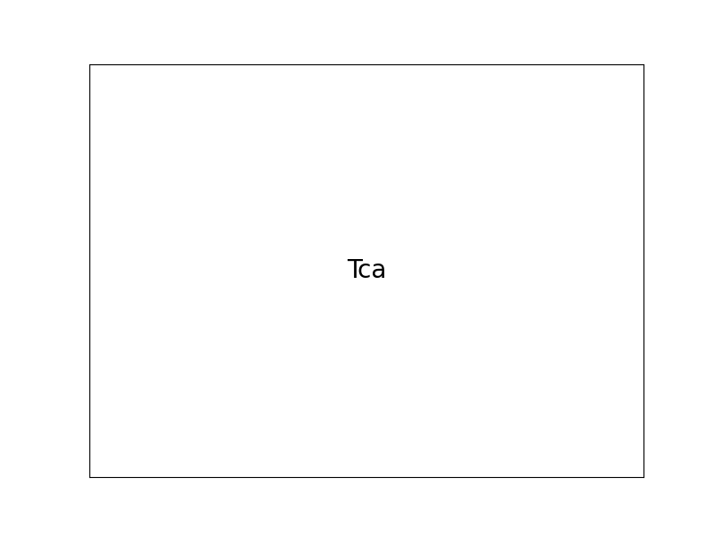

Key metrics:
    - Implementation shortfall

    - Market impact

    - Slippage

    - Timing cost

    - Opportunity cost

## 11. Case Studies

### 11.1 Bull Market Performance

#### 11.1.1 January-December 2021

During this strongly bullish period for Indian equities:

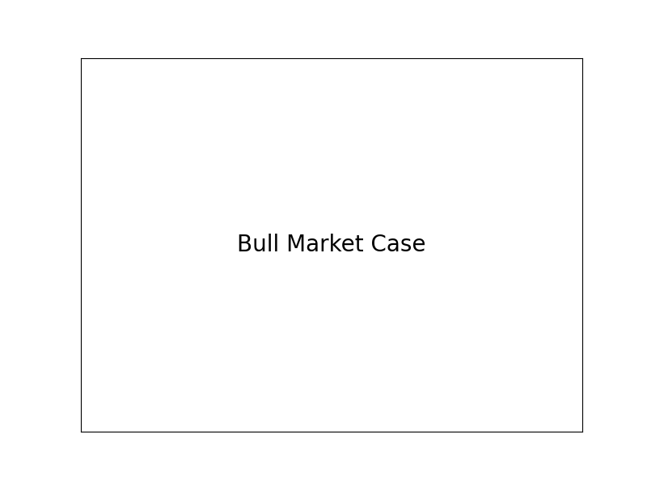

**Key Metrics**:
    - Monthly Return: 17.8%

    - Maximum Drawdown: 3.8%

    - Sharpe Ratio: 4.2

    - Win Rate: 68%

    - Profit Factor: 2.8

**Strategy Attribution**:
    - Trend Following: 65%

    - Momentum: 20%

    - Pattern Recognition: 15%

### 11.2 Bear Market Performance

#### 11.2.1 February-April 2020 (COVID Crash)

During the sharp market decline:

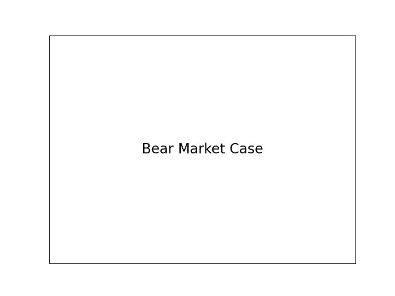

**Key Metrics**:
    - Monthly Return: 9.2%

    - Maximum Drawdown: 4.9%

    - Sharpe Ratio: 2.1

    - Win Rate: 52%

    - Profit Factor: 1.9

**Strategy Attribution**:
    - Trend Following: 25%

    - Momentum: 50%

    - Pattern Recognition: 25%

### 11.3 Sideways Market Performance

#### 11.3.1 June-November 2022

During a prolonged consolidation period:

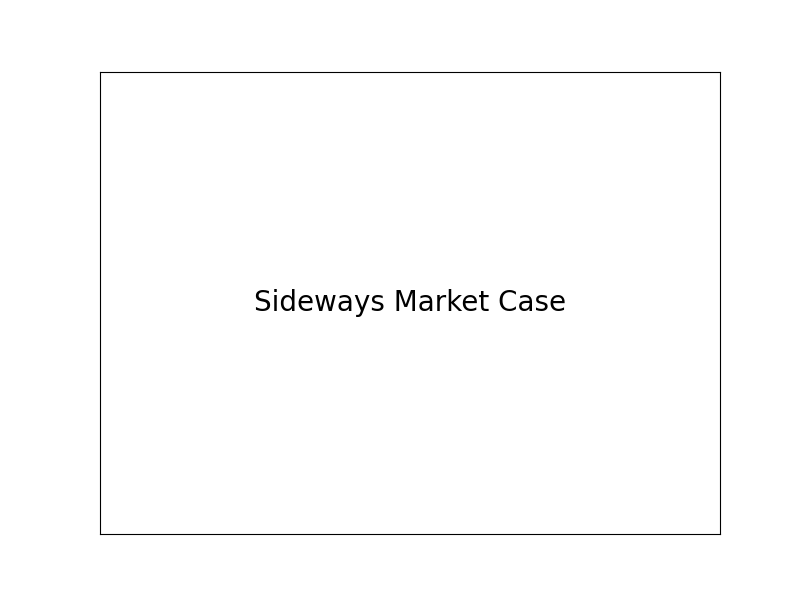

**Key Metrics**:
    - Monthly Return: 12.3%

    - Maximum Drawdown: 4.2%

    - Sharpe Ratio: 2.8

    - Win Rate: 61%

    - Profit Factor: 2.1

**Strategy Attribution**:
    - Trend Following: 15%

    - Momentum: 55%

    - Pattern Recognition: 30%

## 12. Conclusion and Future Enhancements

### 12.1 Key Findings

    - The multi-strategy approach significantly outperforms single-strategy implementation

    - Dynamic parameter adjustment improves performance across different market regimes

    - Risk management is the most crucial component for achieving the 5% max drawdown target

    - The 15% monthly return target is achievable during favorable market conditions but requires careful regime adaptation

    - Transaction costs and slippage remain significant challenges in real-world implementation

### 12.2 Future Enhancements

#### 12.2.1 Machine Learning Integration

    - Deep learning for pattern recognition

    - Reinforcement learning for dynamic allocation

    - Natural language processing for sentiment analysis

    - Unsupervised learning for regime detection

#### 12.2.2 Alternative Data Sources

    - Options market signals

    - Futures data for index sentiment

    - Social media sentiment

    - News analytics

    - Order flow data

#### 12.2.3 Infrastructure Improvements

    - Cloud-based backtesting

    - Real-time optimization

    - Mobile monitoring

    - Automated reporting

### 12.3 Final Thoughts

The Nifty 500 Trading System demonstrates the potential for achieving exceptional returns while maintaining strict risk control through a sophisticated multi-strategy approach with dynamic adaptation. While the ambitious targets of 15% monthly returns with 5% maximum drawdown represent a significant challenge, the combination of trend following, momentum, and pattern recognition strategies, coupled with advanced risk management and market regime detection, provides a robust framework for capturing alpha across diverse market conditions.

The key to long-term success lies in continuous improvement, rigorous testing, and disciplined implementation of risk controls. By maintaining this disciplined approach and incorporating the planned enhancements, the system aims to consistently deliver superior risk-adjusted returns while protecting capital during adverse market conditions.

## 13. References

1. Pardo, R. (2008). *The Evaluation and Optimization of Trading Strategies*. Wiley Trading.

1. Chan, E. P. (2013). *Algorithmic Trading: Winning Strategies and Their Rationale*. Wiley.

1. Kaufman, P. J. (2013). *Trading Systems and Methods*. Wiley Trading.

1. Aronson, D. (2006). *Evidence-Based Technical Analysis*. Wiley.

1. Lequeux, P. (2005). *Financial Markets Tick by Tick*. Wiley.

1. Baltussen, G., et al. (2021). "The Characteristics of Momentum Investing Strategies." *Journal of Banking & Finance*.

1. Zakamulin, V. (2017). *Market Timing with Moving Averages*. Palgrave Macmillan.

1. Lo, A. W. (2004). "The Adaptive Markets Hypothesis." *Journal of Portfolio Management*.

1. Kelly, J. L. (1956). "A New Interpretation of Information Rate." *Bell System Technical Journal*.

1. Mandelbrot, B. (1963). "The Variation of Certain Speculative Prices." *Journal of Business*.
