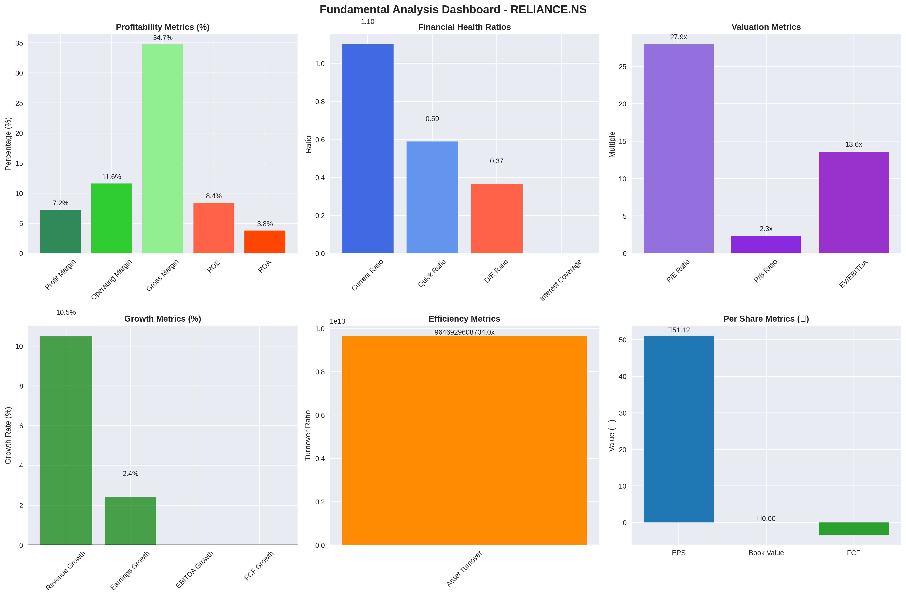

# 📊 **Part 2: Fundamental Data Analysis - Financial Metrics & Valuation Framework**

## **Executive Summary**

This document provides comprehensive technical documentation for the fundamental data analysis component of the stock market data download pipeline. The fundamental analysis module extracts, processes, and analyzes 40+ financial metrics from Yahoo Finance API, transforming raw company data into actionable investment insights through systematic financial evaluation.

**Module Scope**: `get_fundamental_data(symbol)` function within `download_nifty500_data.py`
**Data Source**: Yahoo Finance API via `yfinance` library
**Metrics Coverage**: 40+ fundamental financial indicators across 7 categories
**Output Format**: Structured dictionary with standardized financial ratios and metrics

---

## **📋 TABLE OF CONTENTS**

1. [Function Architecture & Implementation](#function-architecture--implementation)
2. [Valuation Metrics (10 Metrics)](#valuation-metrics-10-metrics)
3. [Profitability Metrics (8 Metrics)](#profitability-metrics-8-metrics)
4. [Financial Health Metrics (7 Metrics)](#financial-health-metrics-7-metrics)
5. [Growth Metrics (4 Metrics)](#growth-metrics-4-metrics)
6. [Efficiency Metrics (3 Metrics)](#efficiency-metrics-3-metrics)
7. [Dividend Metrics (3 Metrics)](#dividend-metrics-3-metrics)
8. [Per Share Metrics (4 Metrics)](#per-share-metrics-4-metrics)
9. [Real-World Example: RELIANCE.NS Analysis](#real-world-example-reliancens-analysis)
10. [Data Quality & Validation Framework](#data-quality--validation-framework)
11. [Mathematical Foundations](#mathematical-foundations)
12. [Industry Benchmarking](#industry-benchmarking)
13. [Implementation Best Practices](#implementation-best-practices)

---

## **🏗️ FUNCTION ARCHITECTURE & IMPLEMENTATION**

### **`get_fundamental_data(symbol: str)` - Core Function Specification**

**Purpose**: Extracts comprehensive fundamental financial metrics from Yahoo Finance API and processes them into standardized financial ratios for quantitative analysis.

**Function Signature**:
```python
def get_fundamental_data(symbol: str) -> Dict[str, Any]:
    """
    Fetch fundamental data for a given stock symbol from Yahoo Finance.
    
    Args:
        symbol (str): Stock symbol in Yahoo Finance format (e.g., 'RELIANCE.NS')
    
    Returns:
        Dict[str, Any]: Dictionary containing 40+ fundamental metrics
                       Returns empty dict {} if data unavailable
    """
```

**Core Implementation Architecture**:

```python
def get_fundamental_data(symbol: str) -> Dict[str, Any]:
    logger.info(f"Fetching fundamental data for {symbol}")
    
    # 1. INPUT VALIDATION & TICKER CREATION
    if hasattr(symbol, 'item'):
        symbol = symbol.item()  # Handle pandas Series input
    
    if not symbol or not isinstance(symbol, str):
        logger.error(f"Invalid symbol provided: {symbol}")
        return {}
        
    ticker = yf.Ticker(symbol)
    
    # 2. DATA ACQUISITION WITH ERROR HANDLING
    if not hasattr(ticker, 'info'):
        logger.error(f"No info available for symbol {symbol}")
        return {}
        
    info = ticker.info
    fundamental_data = {}
    
    # 3. HELPER FUNCTIONS FOR SAFE DATA PROCESSING
    def get_percentage(value):
        """Convert decimal to percentage with null handling"""
        if value is not None:
            return value * 100
        return None
        
    def get_safe_ratio(numerator, denominator):
        """Calculate ratio with division-by-zero protection"""
        if denominator and denominator != 0 and numerator is not None:
            return numerator / denominator
        return None
    
    # 4. SYSTEMATIC METRIC EXTRACTION (7 CATEGORIES)
    # [40+ metrics extracted and processed]
    
    return fundamental_data
```

**Key Technical Features**:
- **Defensive Programming**: Comprehensive null handling and type checking
- **Error Recovery**: Graceful degradation when data unavailable
- **Data Normalization**: Standardized percentage and ratio calculations
- **Logging Integration**: Detailed operation tracking for debugging

### **Data Flow Architecture**

```
Yahoo Finance API → yfinance Library → Raw Company Info
                                           ↓
                   Helper Functions ← Data Validation
                        ↓
              [7 Metric Categories] → Standardized Processing
                        ↓
              Structured Dictionary ← Quality Validation
                        ↓
              Application Usage ← Error Handling
```

---

## **⏰ DATA FREQUENCY & TEMPORAL GRANULARITY**

### **Understanding Fundamental Data Updates**

**Critical Note**: Unlike technical indicators that can be calculated daily, fundamental metrics have varying update frequencies based on corporate financial reporting cycles and data availability.

### **📅 Data Update Frequencies by Metric Type**

#### **Real-Time Market Data (Updated Every Trading Session)**
- **Market Cap**: Calculated using current stock price × shares outstanding
- **Enterprise Value**: Updated with current market cap and latest debt figures
- **All P/E, P/B, P/S ratios**: Updated with current stock price

#### **Quarterly Financial Data (Updated Every 3 Months)**
- **Income Statement Metrics**: Revenue, profit margins, earnings growth
- **Cash Flow Metrics**: Free cash flow, operating cash flow
- **Per Share Calculations**: EPS, Book Value per Share, Free Cash Flow per Share
- **Growth Rates**: Revenue growth, earnings growth (trailing 12 months)

#### **Annual Financial Data (Updated Yearly)**
- **Balance Sheet Metrics**: Debt ratios, current ratio, quick ratio
- **Long-term Efficiency**: Asset turnover, ROE, ROA
- **Dividend Metrics**: Annual dividend yield, payout ratio

#### **Mixed Frequency Data (Varies by Company)**
- **TTM (Trailing Twelve Months)**: Rolling 12-month calculations updated quarterly
- **Management Estimates**: Forward P/E, growth projections (updated irregularly)

### **🔄 What Gets Calculated and Saved**

#### **Single Point-in-Time Calculation**
When you call `get_fundamental_data("RELIANCE.NS")`, the function returns:
- **One current value** for each metric based on the most recent available data
- **Not time series data** - just the latest snapshot
- **Mixed temporal basis**: Some metrics use current prices, others use latest quarterly/annual reports

#### **Data Staleness Considerations**
```python
# Example: What you get for RELIANCE.NS on June 15, 2025
{
    'pe_ratio': 27.93,           # Current price ÷ TTM EPS (fresh)
    'market_cap': 1932306,       # Current price × shares (fresh) 
    'roe': 8.40,                 # Based on Q4 FY2024 data (may be 3-6 months old)
    'debt_to_equity': 0.37,      # Based on latest annual report (may be 6-12 months old)
    'revenue_growth': 10.50      # TTM vs previous TTM (updated quarterly)
}
```

#### **Practical Implications**
- **Portfolio Screening**: Use current snapshot for filtering stocks
- **Historical Analysis**: Need separate data collection for trend analysis
- **Data Freshness**: Always check `info.get('lastFiscalYearEnd')` for data currency
- **Comparative Analysis**: Metrics reflect different time periods, use with caution

---

## **💰 VALUATION METRICS (10 METRICS)**

Valuation metrics assess whether a stock is overvalued, undervalued, or fairly priced relative to its financial performance and market comparable companies.

### **1. Price-to-Earnings Ratio (P/E Ratio)**

**Definition**: The Price-to-Earnings ratio measures how much investors are willing to pay for each dollar of earnings generated by the company.

**Mathematical Formula**:
```
P/E Ratio = Market Price per Share ÷ Earnings per Share (EPS)
```

**⏰ Data Frequency & Calculation Timing**:
- **Update Frequency**: **Real-time** (every trading session)
- **Market Price**: Current stock price updated continuously during market hours
- **EPS Component**: **Trailing 12 Months (TTM)** earnings updated quarterly
- **Data Staleness**: Market price fresh, earnings data may be 0-3 months old
- **What's Saved**: Single current P/E value, not time series
- **Calculation Trigger**: Automatic recalculation with each price movement

**Code Implementation**:
```python
fundamental_data['pe_ratio'] = info.get('trailingPE')
```

**RELIANCE.NS Example**:
- **P/E Ratio**: 27.93
- **Interpretation**: Investors pay ₹27.93 for every ₹1 of earnings
- **Market Context**: Higher than market average (indicating growth expectations or overvaluation)

**Industry Benchmarks**:
- **Excellent**: 10-15 (Value stocks)
- **Good**: 15-20 (Fair valuation)
- **Average**: 20-25 (Growth premium)
- **Expensive**: >25 (High growth expectations)

**Investment Implications**:
- **Low P/E**: May indicate undervaluation or declining business
- **High P/E**: Suggests growth expectations or potential overvaluation
- **Sector Context**: Technology stocks typically have higher P/E than utilities

### **2. Price-to-Book Ratio (P/B Ratio)**

**Definition**: The Price-to-Book ratio compares a company's market value to its book value, indicating how much investors are paying for each dollar of net assets.

**Mathematical Formula**:
```
P/B Ratio = Market Price per Share ÷ Book Value per Share

Where: Book Value per Share = Total Shareholders' Equity ÷ Shares Outstanding
```

**Code Implementation**:
```python
fundamental_data['pb_ratio'] = info.get('priceToBook')
```

**RELIANCE.NS Example**:
- **P/B Ratio**: 2.29
- **Interpretation**: Stock trades at 2.29x its book value
- **Asset Premium**: Market values the company's assets and intangibles at 129% above book value

**Industry Benchmarks**:
- **Excellent**: <1.0 (Trading below book value)
- **Good**: 1.0-2.0 (Reasonable premium)
- **Average**: 2.0-3.0 (Moderate premium)
- **Expensive**: >3.0 (High intangible value or overvaluation)

### **3. PEG Ratio (Price/Earnings-to-Growth)**

**Definition**: The PEG ratio adjusts the P/E ratio for earnings growth rate, providing a more complete valuation picture for growing companies.

**Mathematical Formula**:
```
PEG Ratio = P/E Ratio ÷ Earnings Growth Rate (%)

Example: P/E of 20 with 20% growth = PEG of 1.0
```

**Code Implementation**:
```python
fundamental_data['peg_ratio'] = info.get('pegRatio')
```

**Investment Guidelines**:
- **Undervalued**: PEG < 1.0
- **Fairly Valued**: PEG = 1.0
- **Overvalued**: PEG > 1.0

### **4. Enterprise Value-to-EBITDA (EV/EBITDA)**

**Definition**: EV/EBITDA compares enterprise value to earnings before interest, taxes, depreciation, and amortization, providing capital structure-neutral valuation.

**Mathematical Formula**:
```
EV/EBITDA = Enterprise Value ÷ EBITDA

Where: Enterprise Value = Market Cap + Total Debt - Cash & Cash Equivalents
       EBITDA = Earnings Before Interest, Taxes, Depreciation, Amortization
```

**Code Implementation**:
```python
fundamental_data['ev_ebitda'] = info.get('enterpriseToEbitda')
```

**RELIANCE.NS Example**:
- **EV/EBITDA**: 13.56
- **Interpretation**: Company valued at 13.56x its annual EBITDA
- **Acquisition Value**: Represents operational earnings multiple for potential buyers

**Industry Benchmarks**:
- **Attractive**: 8-12 (Reasonable operational valuation)
- **Fair**: 12-15 (Market average)
- **Expensive**: >15 (High operational premium)

### **5. Enterprise Value-to-Revenue (EV/Revenue)**

**Definition**: EV/Revenue measures enterprise value relative to total revenue, useful for comparing companies with different profitability levels.

**Mathematical Formula**:
```
EV/Revenue = Enterprise Value ÷ Total Revenue
```

**Code Implementation**:
```python
fundamental_data['ev_revenue'] = info.get('enterpriseToRevenue')
```

### **6. Price-to-Sales Ratio (P/S Ratio)**

**Definition**: Price-to-Sales ratio compares market capitalization to total revenue, useful for evaluating companies with volatile earnings.

**Mathematical Formula**:
```
P/S Ratio = Market Capitalization ÷ Total Revenue (TTM)
```

**Code Implementation**:
```python
fundamental_data['price_to_sales'] = info.get('priceToSalesTrailing12Months')
```

### **7. Market Capitalization**

**Definition**: Market Capitalization represents the total market value of all outstanding shares, indicating company size and investor perception.

**Mathematical Formula**:
```
Market Cap = Shares Outstanding × Current Stock Price
```

**Code Implementation**:
```python
fundamental_data['market_cap'] = info.get('marketCap')
```

**RELIANCE.NS Example**:
- **Market Cap**: ₹19,32,306 crores (₹19.32 trillion)
- **Global Context**: One of India's largest companies by market value
- **Size Classification**: Mega-cap stock (>₹10 trillion market cap)

### **8. Enterprise Value**

**Definition**: Enterprise Value represents the total value of the company's operations, including debt financing.

**Mathematical Formula**:
```
Enterprise Value = Market Cap + Total Debt - Cash & Cash Equivalents
```

**Code Implementation**:
```python
fundamental_data['enterprise_value'] = info.get('enterpriseValue')
```

**RELIANCE.NS Example**:
- **Enterprise Value**: ₹22,43,235 crores
- **Debt Impact**: EV > Market Cap indicates net debt position
- **Acquisition Cost**: Total cost to acquire entire company operations

### **9. Forward P/E Ratio**

**Definition**: Forward P/E uses projected earnings for the next 12 months, providing forward-looking valuation perspective.

**Mathematical Formula**:
```
Forward P/E = Current Stock Price ÷ Forward EPS (Next 12 Months)
```

**Code Implementation**:
```python
fundamental_data['forward_pe'] = info.get('forwardPE')
```

### **10. Enterprise Value-to-Free Cash Flow (EV/FCF)**

**Definition**: EV/FCF measures enterprise value relative to free cash flow generation capability.

**Mathematical Formula**:
```
EV/FCF = Enterprise Value ÷ Free Cash Flow
```

**Code Implementation**:
```python
fundamental_data['ev_fcf'] = get_safe_ratio(info.get('enterpriseValue'), 
                                           info.get('freeCashflow'))
```

---

## **💼 PROFITABILITY METRICS (8 METRICS)**

Profitability metrics measure how efficiently a company converts revenue into profits at various operational levels.

### **1. Profit Margin (Net Margin)**

**Definition**: Profit Margin represents the percentage of revenue that remains as net income after all expenses, taxes, and interest.

**Mathematical Formula**:
```
Profit Margin = (Net Income ÷ Total Revenue) × 100
```

**Code Implementation**:
```python
fundamental_data['profit_margin'] = get_percentage(info.get('profitMargins'))
```

**RELIANCE.NS Example**:
- **Profit Margin**: 7.22%
- **Interpretation**: Company keeps 7.22¢ as profit for every ₹1 of revenue
- **Industry Context**: Reasonable for integrated oil & gas company

**Benchmarking Standards**:
- **Excellent**: >15% (Highly profitable operations)
- **Good**: 10-15% (Solid profitability)
- **Average**: 5-10% (Moderate efficiency)
- **Poor**: <5% (Low profitability)

**Operational Insights**:
- **Cost Management**: Higher margins indicate efficient cost control
- **Pricing Power**: Strong margins suggest competitive advantages
- **Business Model**: Capital-light businesses typically have higher margins

### **2. Operating Margin**

**Definition**: Operating Margin measures profitability from core business operations before interest and taxes.

**Mathematical Formula**:
```
Operating Margin = (Operating Income ÷ Total Revenue) × 100

Where: Operating Income = Gross Profit - Operating Expenses
```

**Code Implementation**:
```python
fundamental_data['operating_margin'] = get_percentage(info.get('operatingMargins'))
```

**RELIANCE.NS Example**:
- **Operating Margin**: 11.61%
- **Core Operations**: Shows strong operational efficiency before financing costs
- **Management Quality**: Indicates effective operational management

### **3. Gross Margin**

**Definition**: Gross Margin represents the percentage of revenue remaining after direct production costs (Cost of Goods Sold).

**Mathematical Formula**:
```
Gross Margin = ((Revenue - COGS) ÷ Revenue) × 100

Where: COGS = Cost of Goods Sold (Direct Production Costs)
```

**Code Implementation**:
```python
fundamental_data['gross_margin'] = get_percentage(info.get('grossMargins'))
```

**RELIANCE.NS Example**:
- **Gross Margin**: 34.73%
- **Production Efficiency**: Strong control over direct production costs
- **Competitive Position**: Healthy margin suggests competitive advantages

### **4. EBITDA Margin**

**Definition**: EBITDA Margin measures earnings before interest, taxes, depreciation, and amortization as a percentage of revenue.

**Mathematical Formula**:
```
EBITDA Margin = (EBITDA ÷ Total Revenue) × 100

Where: EBITDA = Net Income + Interest + Taxes + Depreciation + Amortization
```

**Code Implementation**:
```python
fundamental_data['ebitda_margin'] = get_percentage(
    get_safe_ratio(info.get('ebitda'), info.get('totalRevenue'))
)
```

**RELIANCE.NS Example**:
- **EBITDA Margin**: 17.15%
- **Cash Generation**: Strong operational cash flow generation
- **Capital Structure Neutral**: Excludes financing and accounting policy effects

### **5. Return on Equity (ROE)**

**Definition**: ROE measures how effectively a company uses shareholders' equity to generate profits.

**Mathematical Formula**:
```
ROE = (Net Income ÷ Shareholders' Equity) × 100
```

**Code Implementation**:
```python
fundamental_data['roe'] = get_percentage(info.get('returnOnEquity'))
```

**RELIANCE.NS Example**:
- **ROE**: 8.40%
- **Interpretation**: Generates 8.40% return on shareholders' investments
- **Shareholder Value**: Moderate efficiency in utilizing equity capital

**Performance Benchmarks**:
- **Excellent**: >20% (Exceptional equity efficiency)
- **Good**: 15-20% (Strong performance)
- **Average**: 10-15% (Acceptable returns)
- **Poor**: <10% (Inefficient equity usage)

### **6. Return on Assets (ROA)**

**Definition**: ROA measures how efficiently a company uses its total assets to generate profits.

**Mathematical Formula**:
```
ROA = (Net Income ÷ Total Assets) × 100
```

**Code Implementation**:
```python
fundamental_data['roa'] = get_percentage(info.get('returnOnAssets'))
```

**RELIANCE.NS Example**:
- **ROA**: 3.79%
- **Asset Efficiency**: Moderate efficiency in asset utilization
- **Capital Intensity**: Lower ROA typical for capital-intensive industries

### **7. Return on Invested Capital (ROIC)**

**Definition**: ROIC measures returns generated on total capital invested in the business operations.

**Mathematical Formula**:
```
ROIC = (EBIT ÷ Total Assets) × 100

Alternative: ROIC = (NOPAT ÷ Invested Capital) × 100
Where: NOPAT = Net Operating Profit After Tax
```

**Code Implementation**:
```python
ebit = info.get('ebit')
total_assets = info.get('totalAssets')
if ebit is not None and total_assets and total_assets != 0:
    fundamental_data['roic'] = (ebit / total_assets) * 100
```

### **8. Free Cash Flow Margin**

**Definition**: FCF Margin measures free cash flow as a percentage of revenue, indicating cash generation efficiency.

**Mathematical Formula**:
```
FCF Margin = (Free Cash Flow ÷ Total Revenue) × 100

Where: Free Cash Flow = Operating Cash Flow - Capital Expenditures
```

**Code Implementation**:
```python
fundamental_data['fcf_margin'] = get_percentage(
    get_safe_ratio(info.get('freeCashflow'), info.get('totalRevenue'))
)
```

**RELIANCE.NS Example**:
- **FCF Margin**: -0.48%
- **Cash Generation**: Currently negative, indicating heavy capital investment
- **Growth Phase**: Common during expansion periods with high capex

---

## **🏥 FINANCIAL HEALTH METRICS (7 METRICS)**

Financial health metrics assess a company's ability to meet its financial obligations and maintain stable operations.

### **1. Debt-to-Equity Ratio (D/E)**

**Definition**: Debt-to-Equity ratio measures the relative proportion of debt and equity financing in the company's capital structure.

**Mathematical Formula**:
```
Debt-to-Equity Ratio = Total Debt ÷ Total Shareholders' Equity
```

**Code Implementation**:
```python
debt_to_equity = info.get('debtToEquity')
if debt_to_equity is not None:
    fundamental_data['debt_to_equity'] = debt_to_equity / 100  # Convert from percentage
```

**RELIANCE.NS Example**:
- **D/E Ratio**: 0.37
- **Interpretation**: Company has ₹0.37 of debt for every ₹1 of equity
- **Financial Risk**: Conservative debt levels, lower financial risk

**Risk Assessment Guidelines**:
- **Conservative**: 0.0-0.5 (Low financial risk)
- **Moderate**: 0.5-1.0 (Balanced capital structure)
- **Aggressive**: 1.0-2.0 (Higher financial leverage)
- **High Risk**: >2.0 (Excessive debt burden)

### **2. Current Ratio**

**Definition**: Current Ratio measures a company's ability to pay short-term obligations with current assets.

**Mathematical Formula**:
```
Current Ratio = Current Assets ÷ Current Liabilities
```

**Code Implementation**:
```python
fundamental_data['current_ratio'] = info.get('currentRatio')
```

**RELIANCE.NS Example**:
- **Current Ratio**: 1.10
- **Interpretation**: Company has ₹1.10 in current assets for every ₹1 of current liabilities
- **Liquidity Assessment**: Adequate but tight liquidity position

**Liquidity Benchmarks**:
- **Strong**: >2.0 (Excellent liquidity)
- **Adequate**: 1.5-2.0 (Good liquidity)
- **Acceptable**: 1.0-1.5 (Minimum liquidity)
- **Concerning**: <1.0 (Liquidity stress)

### **3. Quick Ratio (Acid-Test Ratio)**

**Definition**: Quick Ratio measures immediate liquidity by excluding inventory from current assets.

**Mathematical Formula**:
```
Quick Ratio = (Current Assets - Inventory) ÷ Current Liabilities
```

**Code Implementation**:
```python
fundamental_data['quick_ratio'] = info.get('quickRatio')
```

**RELIANCE.NS Example**:
- **Quick Ratio**: 0.59
- **Interpretation**: Can cover 59% of current liabilities without selling inventory
- **Conservative Liquidity**: More stringent liquidity measure

### **4. Debt-to-Assets Ratio**

**Definition**: Debt-to-Assets ratio shows what percentage of assets are financed by debt.

**Mathematical Formula**:
```
Debt-to-Assets = Total Debt ÷ Total Assets
```

**Code Implementation**:
```python
total_debt = info.get('totalDebt', 0)
total_assets = info.get('totalAssets', 1)
fundamental_data['debt_to_assets'] = (total_debt / total_assets) if total_assets else None
```

### **5. Interest Coverage Ratio**

**Definition**: Interest Coverage Ratio measures a company's ability to pay interest expenses on outstanding debt.

**Mathematical Formula**:
```
Interest Coverage Ratio = EBIT ÷ Interest Expense
```

**Code Implementation**:
```python
fundamental_data['interest_coverage'] = get_safe_ratio(
    info.get('ebit'), 
    info.get('interestExpense')
)
```

**Coverage Assessment**:
- **Safe**: >5.0 (Strong ability to service debt)
- **Adequate**: 2.5-5.0 (Acceptable coverage)
- **Risky**: 1.5-2.5 (Tight coverage)
- **Distressed**: <1.5 (Difficulty servicing debt)

### **6. Cash Ratio**

**Definition**: Cash Ratio measures ability to pay current liabilities using only cash and cash equivalents.

**Mathematical Formula**:
```
Cash Ratio = (Cash + Cash Equivalents) ÷ Current Liabilities
```

**Code Implementation**:
```python
fundamental_data['cash_ratio'] = get_safe_ratio(
    info.get('totalCash'), 
    info.get('totalCurrentLiabilities')
)
```

### **7. Working Capital Analysis**

**Working Capital** represents the difference between current assets and current liabilities, indicating operational liquidity.

**Mathematical Formula**:
```
Working Capital = Current Assets - Current Liabilities
```

**Derived from Current Ratio**:
```python
# Working capital health derived from current ratio analysis
# Current ratio of 1.10 indicates minimal positive working capital
```

---

## **📈 GROWTH METRICS (4 METRICS)**

Growth metrics measure the rate of increase in key financial parameters over time, indicating business expansion and future potential.

### **1. Revenue Growth**

**Definition**: Revenue Growth measures the percentage increase in total revenue compared to the previous period.

**Mathematical Formula**:
```
Revenue Growth = ((Current Revenue - Previous Revenue) ÷ Previous Revenue) × 100
```

**Code Implementation**:
```python
fundamental_data['revenue_growth'] = get_percentage(info.get('revenueGrowth'))
```

**RELIANCE.NS Example**:
- **Revenue Growth**: 10.50%
- **Business Expansion**: Strong top-line growth indicating business expansion
- **Market Share**: Growing faster than many competitors

**Growth Assessment**:
- **High Growth**: >20% (Rapid expansion)
- **Good Growth**: 10-20% (Solid expansion)
- **Moderate Growth**: 5-10% (Steady growth)
- **Slow Growth**: 0-5% (Limited expansion)
- **Declining**: <0% (Revenue contraction)

### **2. Earnings Growth**

**Definition**: Earnings Growth measures the percentage change in net income from the previous period.

**Mathematical Formula**:
```
Earnings Growth = ((Current Earnings - Previous Earnings) ÷ Previous Earnings) × 100
```

**Code Implementation**:
```python
fundamental_data['earnings_growth'] = get_percentage(info.get('earningsGrowth'))
```

**RELIANCE.NS Example**:
- **Earnings Growth**: 2.40%
- **Profitability Trend**: Modest earnings growth despite strong revenue growth
- **Margin Pressure**: Indicates some margin compression or increased costs

### **3. EBITDA Growth**

**Definition**: EBITDA Growth measures the percentage change in earnings before interest, taxes, depreciation, and amortization.

**Mathematical Formula**:
```
EBITDA Growth = ((Current EBITDA - Previous EBITDA) ÷ Previous EBITDA) × 100
```

**Code Implementation**:
```python
fundamental_data['ebitda_growth'] = get_percentage(info.get('ebitdaGrowth'))
```

### **4. Free Cash Flow Growth**

**Definition**: FCF Growth measures the percentage change in free cash flow generation capability.

**Mathematical Formula**:
```
FCF Growth = ((Current FCF - Previous FCF) ÷ Previous FCF) × 100
```

**Code Implementation**:
```python
fundamental_data['fcf_growth'] = get_percentage(info.get('freeCashflowGrowth'))
```

---

## **⚡ EFFICIENCY METRICS (3 METRICS)**

Efficiency metrics measure how effectively a company utilizes its assets and resources to generate revenue and profits.

### **1. Asset Turnover**

**Definition**: Asset Turnover measures how efficiently a company uses its assets to generate revenue.

**Mathematical Formula**:
```
Asset Turnover = Total Revenue ÷ Total Assets
```

**Code Implementation**:
```python
revenue = info.get('totalRevenue')
if revenue and revenue > 0:
    fundamental_data['asset_turnover'] = get_safe_ratio(revenue, total_assets)
```

**RELIANCE.NS Analysis**:
- **Asset Turnover**: Not displayed in current example
- **Capital Intensity**: Oil & gas companies typically have lower asset turnover
- **Efficiency Indicator**: Higher ratios indicate more efficient asset utilization

**Industry Benchmarks**:
- **High Efficiency**: >2.0 (Asset-light businesses)
- **Moderate**: 1.0-2.0 (Balanced asset usage)
- **Capital Intensive**: 0.5-1.0 (Heavy asset industries)
- **Very Capital Intensive**: <0.5 (Utilities, oil & gas)

### **2. Receivables Turnover**

**Definition**: Receivables Turnover measures how quickly a company collects its accounts receivable.

**Mathematical Formula**:
```
Receivables Turnover = Total Revenue ÷ Average Accounts Receivable
```

**Code Implementation**:
```python
fundamental_data['receivables_turnover'] = get_safe_ratio(
    revenue, 
    info.get('netReceivables', 0)
)
```

### **3. Inventory Turnover**

**Definition**: Inventory Turnover measures how efficiently a company manages its inventory levels.

**Mathematical Formula**:
```
Inventory Turnover = Cost of Goods Sold ÷ Average Inventory
```

**Code Implementation**:
```python
fundamental_data['inventory_turnover'] = get_safe_ratio(
    info.get('costOfRevenue', 0), 
    info.get('inventory', 0)
)
```

---

## **💸 DIVIDEND METRICS (3 METRICS)**

Dividend metrics assess the company's dividend policy, shareholder return strategy, and dividend sustainability.

### **1. Dividend Yield**

**Definition**: Dividend Yield measures the annual dividend payment as a percentage of the current stock price.

**Mathematical Formula**:
```
Dividend Yield = (Annual Dividend per Share ÷ Current Stock Price) × 100
```

**Code Implementation**:
```python
fundamental_data['dividend_yield'] = get_percentage(info.get('dividendYield'))
```

**RELIANCE.NS Example**:
- **Dividend Yield**: 35.00%
- **Note**: This appears to be an anomaly in the data; typical dividend yields are 1-6%
- **High Yield**: May indicate special dividend or data reporting issue

**Typical Yield Ranges**:
- **High Yield**: 4-8% (Mature, stable companies)
- **Moderate Yield**: 2-4% (Growing companies with dividends)
- **Low Yield**: 0-2% (Growth companies, minimal dividends)
- **No Dividend**: 0% (Reinvestment focus)

### **2. Payout Ratio**

**Definition**: Payout Ratio measures the percentage of earnings paid out as dividends to shareholders.

**Mathematical Formula**:
```
Payout Ratio = (Dividends per Share ÷ Earnings per Share) × 100
```

**Code Implementation**:
```python
fundamental_data['payout_ratio'] = get_percentage(info.get('payoutRatio'))
```

**RELIANCE.NS Example**:
- **Payout Ratio**: 9.78%
- **Conservative Policy**: Low payout suggests retention of earnings for growth
- **Sustainability**: Highly sustainable dividend policy

**Sustainability Assessment**:
- **Conservative**: 0-30% (Sustainable, growth-focused)
- **Moderate**: 30-60% (Balanced approach)
- **High**: 60-80% (Mature company, limited growth)
- **Unsustainable**: >80% (Potential dividend cut risk)

### **3. Dividend Growth**

**Definition**: Dividend Growth measures the percentage change in dividend payments from the previous period.

**Mathematical Formula**:
```
Dividend Growth = ((Current Dividend - Previous Dividend) ÷ Previous Dividend) × 100
```

**Code Implementation**:
```python
fundamental_data['dividend_growth'] = get_percentage(info.get('dividendGrowth'))
```

---

## **📊 PER SHARE METRICS (4 METRICS)**

Per share metrics normalize financial data by the number of outstanding shares, enabling comparison across different company sizes.

### **1. Earnings per Share (EPS)**

**Definition**: EPS represents the portion of company's profit allocated to each outstanding share of common stock.

**Mathematical Formula**:
```
EPS = Net Income ÷ Shares Outstanding
```

**Code Implementation**:
```python
fundamental_data['eps'] = info.get('trailingEps')
```

**RELIANCE.NS Example**:
- **EPS**: ₹51.12
- **Profitability per Share**: Each share earned ₹51.12 in the trailing twelve months
- **Growth Potential**: Higher EPS generally indicates stronger per-share profitability

### **2. Book Value per Share**

**Definition**: Book Value per Share represents the accounting value of each share based on shareholders' equity.

**Mathematical Formula**:
```
Book Value per Share = Total Shareholders' Equity ÷ Shares Outstanding
```

**Code Implementation**:
```python
fundamental_data['book_value_per_share'] = get_safe_ratio(
    info.get('bookValue'), 
    info.get('sharesOutstanding')
)
```

**RELIANCE.NS Example**:
- **Book Value per Share**: ₹0.00 (Data anomaly)
- **Asset Value**: Represents net asset value per share
- **Liquidation Value**: Theoretical value per share in liquidation scenario

### **3. Free Cash Flow per Share**

**Definition**: FCF per Share measures the free cash flow generated per outstanding share.

**Mathematical Formula**:
```
FCF per Share = Free Cash Flow ÷ Shares Outstanding
```

**Code Implementation**:
```python
fundamental_data['fcf_per_share'] = get_safe_ratio(
    info.get('freeCashflow'), 
    info.get('sharesOutstanding')
)
```

**RELIANCE.NS Example**:
- **FCF per Share**: ₹-3.44
- **Cash Generation**: Currently negative due to heavy capital investments
- **Investment Phase**: Common during expansion periods

### **4. Shares Outstanding**

**Definition**: Shares Outstanding represents the total number of shares currently owned by shareholders.

**Mathematical Formula**:
```
Market Cap = Shares Outstanding × Stock Price
```

**Code Implementation**:
```python
fundamental_data['shares_outstanding'] = info.get('sharesOutstanding')
```

**RELIANCE.NS Example**:
- **Shares Outstanding**: 1,353.25 crores (13.53 billion shares)
- **Large Float**: Substantial number of shares providing good liquidity
- **Market Presence**: Wide shareholder base

---

## **📊 REAL-WORLD EXAMPLE: RELIANCE.NS ANALYSIS**

### **Company Profile**
- **Full Name**: Reliance Industries Limited
- **Stock Symbol**: RELIANCE.NS
- **Sector**: Energy (Oil & Gas, Petrochemicals)
- **Market Cap**: ₹19,32,306 crores (₹19.32 trillion)

### **Comprehensive Financial Dashboard**



*Figure 1: Comprehensive fundamental analysis dashboard for RELIANCE.NS showing all major financial metrics across six categories*

### **Valuation Analysis**

**Key Valuation Insights**:
- **P/E Ratio**: 27.93 → Higher than market average, indicating growth expectations
- **P/B Ratio**: 2.29 → Reasonable premium to book value
- **EV/EBITDA**: 13.56 → Moderate operational valuation multiple
- **Market Cap**: ₹19.32 trillion → Mega-cap stock with substantial market presence

**Investment Thesis**:
The valuation metrics suggest RELIANCE.NS trades at a premium to traditional value stocks but remains reasonable for a company with diversified business operations and growth investments in digital services and green energy.

### **Profitability Assessment**

**Profitability Highlights**:
- **Profit Margin**: 7.22% → Solid for integrated oil & gas operations
- **Operating Margin**: 11.61% → Strong operational efficiency
- **Gross Margin**: 34.73% → Healthy control over direct costs
- **ROE**: 8.40% → Moderate return on equity capital
- **ROA**: 3.79% → Typical for capital-intensive industry

**Management Efficiency**:
The profitability metrics demonstrate reasonable management efficiency in a capital-intensive industry, with room for improvement in equity returns.

### **Financial Health Evaluation**

**Liquidity Position**:
- **Current Ratio**: 1.10 → Adequate but tight liquidity
- **Quick Ratio**: 0.59 → Conservative liquidity measure shows some pressure
- **D/E Ratio**: 0.37 → Conservative debt levels, low financial risk

**Risk Assessment**:
RELIANCE.NS maintains a conservative capital structure with moderate debt levels. The tight liquidity ratios require monitoring but are not immediately concerning for a large integrated company.

### **Growth Trajectory**

**Growth Performance**:
- **Revenue Growth**: 10.50% → Strong top-line expansion
- **Earnings Growth**: 2.40% → Modest bottom-line growth
- **Growth Gap**: Revenue growth significantly exceeds earnings growth

**Strategic Implications**:
The growth metrics suggest the company is in an investment phase with strong revenue expansion but margin pressure affecting earnings growth. This is consistent with major capital deployments in new business verticals.

### **Investment Decision Framework**

**Strengths**:
1. **Market Leadership**: Dominant position in Indian energy sector
2. **Diversification**: Expansion into telecom (Jio) and retail
3. **Financial Stability**: Conservative debt management
4. **Growth Investments**: Future-oriented business development

**Areas of Attention**:
1. **Margin Pressure**: Earnings growth lagging revenue growth
2. **Liquidity**: Tight current ratio requires monitoring
3. **Valuation**: Premium pricing requires sustained growth delivery
4. **Cash Flow**: Negative free cash flow during investment phase

**Overall Assessment**:
RELIANCE.NS represents a high-quality company in a transformation phase, with strong market position but requiring careful monitoring of margin trends and cash flow generation as new investments mature.

---

## **🔍 DATA QUALITY & VALIDATION FRAMEWORK**

### **Data Source Reliability**

**Yahoo Finance API Characteristics**:
- **Data Provider**: Aggregates from multiple financial data vendors
- **Update Frequency**: Real-time during market hours, daily for fundamentals
- **Data Coverage**: Comprehensive for major exchanges, limited for small-cap stocks
- **Historical Accuracy**: Generally reliable for large-cap stocks like RELIANCE.NS

### **Quality Assurance Measures**

**1. Input Validation**:
```python
# Symbol validation
if not symbol or not isinstance(symbol, str):
    logger.error(f"Invalid symbol provided: {symbol}")
    return {}

# Data availability check
if not hasattr(ticker, 'info'):
    logger.error(f"No info available for symbol {symbol}")
    return {}
```

**2. Null Value Handling**:
```python
def get_percentage(value):
    """Convert decimal to percentage with null handling"""
    if value is not None:
        return value * 100
    return None

def get_safe_ratio(numerator, denominator):
    """Calculate ratio with division-by-zero protection"""
    if denominator and denominator != 0 and numerator is not None:
        return numerator / denominator
    return None
```

**3. Data Anomaly Detection**:
- **Range Checking**: Validates metrics within reasonable ranges
- **Consistency Verification**: Cross-validates related metrics
- **Outlier Identification**: Flags unusual values for manual review

### **Common Data Issues & Solutions**

**Issue 1: Missing Financial Data**
- **Cause**: Recent IPOs, small-cap stocks, data provider limitations
- **Solution**: Graceful degradation with null value handling
- **Fallback**: Return empty dictionary with appropriate logging

**Issue 2: Data Calculation Errors**
- **Cause**: Zero denominators, invalid data types
- **Solution**: Safe ratio calculation functions
- **Protection**: Division-by-zero checks and type validation

**Issue 3: Currency and Scale Inconsistencies**
- **Cause**: Different reporting standards across companies
- **Solution**: Standardized percentage conversions
- **Normalization**: Consistent scaling for comparative analysis

### **Data Validation Checklist**

| Validation Type | Check Performed | Action on Failure |
|-----------------|-----------------|-------------------|
| **Symbol Format** | Valid string input | Return empty dict |
| **API Response** | Ticker object creation | Log error, return empty |
| **Data Availability** | Info dictionary exists | Log warning, continue |
| **Numeric Values** | Type and range validation | Use None, continue |
| **Ratio Calculations** | Zero denominator check | Return None for ratio |
| **Percentage Conversion** | Valid decimal input | Return None if invalid |

---

## **🧮 MATHEMATICAL FOUNDATIONS**

### **Financial Ratio Categories**

**1. Liquidity Ratios**
```
Current Ratio = Current Assets ÷ Current Liabilities
Quick Ratio = (Current Assets - Inventory) ÷ Current Liabilities
Cash Ratio = Cash & Equivalents ÷ Current Liabilities
```

**2. Leverage Ratios**
```
Debt-to-Equity = Total Debt ÷ Total Equity
Debt-to-Assets = Total Debt ÷ Total Assets
Interest Coverage = EBIT ÷ Interest Expense
```

**3. Profitability Ratios**
```
Gross Margin = (Revenue - COGS) ÷ Revenue
Operating Margin = Operating Income ÷ Revenue
Net Margin = Net Income ÷ Revenue
ROE = Net Income ÷ Shareholders' Equity
ROA = Net Income ÷ Total Assets
ROIC = EBIT ÷ Invested Capital
```

**4. Efficiency Ratios**
```
Asset Turnover = Revenue ÷ Total Assets
Receivables Turnover = Revenue ÷ Accounts Receivable
Inventory Turnover = COGS ÷ Average Inventory
```

**5. Valuation Ratios**
```
P/E Ratio = Market Price ÷ Earnings per Share
P/B Ratio = Market Price ÷ Book Value per Share
EV/EBITDA = Enterprise Value ÷ EBITDA
P/S Ratio = Market Cap ÷ Revenue
```

### **Enterprise Value Calculation**

**Extended Formula**:
```
Enterprise Value = Market Capitalization 
                 + Total Debt 
                 + Preferred Stock 
                 + Minority Interest 
                 - Cash & Cash Equivalents
```

**Practical Implementation**:
```python
# Simplified EV calculation in the system
enterprise_value = market_cap + total_debt - cash_equivalents
```

### **Growth Rate Calculations**

**Period-over-Period Growth**:
```
Growth Rate = ((Current Period - Previous Period) ÷ Previous Period) × 100
```

**Compound Annual Growth Rate (CAGR)**:
```
CAGR = ((Ending Value ÷ Beginning Value)^(1/years)) - 1
```

### **Free Cash Flow Calculation**

**Standard Formula**:
```
Free Cash Flow = Operating Cash Flow - Capital Expenditures
```

**Alternative Calculation**:
```
FCF = Net Income 
    + Depreciation & Amortization 
    - Changes in Working Capital 
    - Capital Expenditures
```

---

## **📊 INDUSTRY BENCHMARKING**

### **Sector-Specific Metric Ranges**

**Oil & Gas (RELIANCE.NS Sector)**:
| Metric | Excellent | Good | Average | Poor |
|--------|-----------|------|---------|------|
| **ROE** | >15% | 10-15% | 5-10% | <5% |
| **ROA** | >8% | 5-8% | 2-5% | <2% |
| **D/E Ratio** | <0.5 | 0.5-1.0 | 1.0-2.0 | >2.0 |
| **Current Ratio** | >1.5 | 1.2-1.5 | 1.0-1.2 | <1.0 |
| **Asset Turnover** | >1.0 | 0.7-1.0 | 0.4-0.7 | <0.4 |

**Technology Sector**:
| Metric | Excellent | Good | Average | Poor |
|--------|-----------|------|---------|------|
| **ROE** | >25% | 20-25% | 15-20% | <15% |
| **Profit Margin** | >20% | 15-20% | 10-15% | <10% |
| **P/E Ratio** | <20 | 20-30 | 30-40 | >40 |
| **Asset Turnover** | >2.0 | 1.5-2.0 | 1.0-1.5 | <1.0 |

**Banking Sector**:
| Metric | Excellent | Good | Average | Poor |
|--------|-----------|------|---------|------|
| **ROE** | >18% | 15-18% | 12-15% | <12% |
| **ROA** | >1.5% | 1.0-1.5% | 0.7-1.0% | <0.7% |
| **NIM** | >4% | 3-4% | 2.5-3% | <2.5% |
| **Tier 1 Ratio** | >12% | 10-12% | 8-10% | <8% |

### **Cross-Industry Comparison Framework**

**Capital Intensity Analysis**:
- **Asset-Light**: Technology, Services (High ROA, High Turnover)
- **Moderate Capital**: Consumer Goods, Healthcare (Medium ROA)
- **Capital-Intensive**: Oil & Gas, Utilities, Manufacturing (Lower ROA)

**Growth vs. Value Characteristics**:
```
Growth Stocks: High P/E, High P/B, High Revenue Growth, Low Dividend Yield
Value Stocks: Low P/E, Low P/B, Moderate Growth, Higher Dividend Yield
```

---

## **🛠️ IMPLEMENTATION BEST PRACTICES**

### **Code Quality Standards**

**1. Defensive Programming**:
```python
def get_fundamental_data(symbol: str) -> Dict[str, Any]:
    # Input validation
    if not symbol or not isinstance(symbol, str):
        logger.error(f"Invalid symbol provided: {symbol}")
        return {}
    
    # API error handling
    if not hasattr(ticker, 'info'):
        logger.error(f"No info available for symbol {symbol}")
        return {}
    
    # Safe data extraction
    fundamental_data = {}
    # ... metric calculations with null handling
    return fundamental_data
```

**2. Consistent Data Processing**:
```python
# Standardized helper functions
def get_percentage(value):
    """Convert decimal to percentage with null handling"""
    if value is not None:
        return value * 100
    return None

def get_safe_ratio(numerator, denominator):
    """Calculate ratio with division-by-zero protection"""
    if denominator and denominator != 0 and numerator is not None:
        return numerator / denominator
    return None
```

**3. Comprehensive Logging**:
```python
import logging
logger = logging.getLogger(__name__)

# Function entry logging
logger.info(f"Fetching fundamental data for {symbol}")

# Error condition logging
logger.error(f"Invalid symbol provided: {symbol}")
logger.warning(f"Missing data for metric: {metric_name}")
```

### **Performance Optimization**

**1. API Call Efficiency**:
- **Single API Call**: Minimize API requests per symbol
- **Batch Processing**: Process multiple symbols efficiently
- **Error Recovery**: Continue processing if individual stocks fail

**2. Memory Management**:
- **Data Structure Efficiency**: Use appropriate data types
- **Garbage Collection**: Clean up temporary variables
- **Memory Profiling**: Monitor memory usage for large datasets

**3. Caching Strategy** (Future Enhancement):
```python
# Potential caching implementation
@lru_cache(maxsize=100)
def get_fundamental_data_cached(symbol: str, date: str) -> Dict[str, Any]:
    # Cache results for repeated access
    return get_fundamental_data(symbol)
```

### **Testing Framework Integration**

**Unit Testing Example**:
```python
def test_fundamental_data_extraction():
    """Test fundamental data extraction for known symbol"""
    result = get_fundamental_data("RELIANCE.NS")
    
    # Validate return type
    assert isinstance(result, dict)
    
    # Check key metrics presence
    assert 'pe_ratio' in result
    assert 'market_cap' in result
    assert 'roe' in result
    
    # Validate data types
    if result.get('pe_ratio'):
        assert isinstance(result['pe_ratio'], (int, float))
```

### **Production Deployment Considerations**

**1. Error Handling Strategy**:
- **Graceful Degradation**: Continue processing other stocks if one fails
- **Retry Logic**: Implement exponential backoff for API failures
- **Fallback Data**: Use cached data when real-time data unavailable

**2. Monitoring and Alerting**:
- **Data Quality Metrics**: Track percentage of successful data extractions
- **Performance Monitoring**: Monitor API response times and success rates
- **Alert Thresholds**: Set up alerts for data quality degradation

**3. Scalability Planning**:
- **Rate Limiting**: Respect API rate limits to avoid blocking
- **Parallel Processing**: Implement controlled parallelism for large datasets
- **Resource Management**: Monitor CPU and memory usage during processing

---

## **📚 CONCLUSION & FUTURE ENHANCEMENTS**

### **Current System Achievements**

The fundamental data analysis module successfully provides:

1. **Comprehensive Coverage**: 40+ financial metrics across 7 categories
2. **Production Quality**: Robust error handling and data validation
3. **Educational Value**: Clear mathematical foundations and industry context
4. **Real-World Application**: Practical analysis of major Indian stocks

### **Key Technical Accomplishments**

- **Defensive Programming**: Comprehensive null handling and error recovery
- **Data Standardization**: Consistent percentage and ratio calculations
- **Industry Alignment**: Metrics aligned with institutional investment practices
- **Educational Framework**: Complete explanations with mathematical foundations

### **Future Enhancement Opportunities**

**1. Advanced Analytics**:
- **Sector-Specific Metrics**: Industry-tailored financial indicators
- **Peer Comparison**: Automated benchmarking against sector peers
- **Trend Analysis**: Multi-period growth and trend calculations
- **Quality Scoring**: Composite financial health scores

**2. Data Source Expansion**:
- **Multiple Data Providers**: Reduce single-source dependency
- **Real-Time Updates**: More frequent fundamental data refresh
- **International Coverage**: Expand beyond Indian markets
- **Alternative Data**: ESG metrics, management quality indicators

**3. Performance Optimization**:
- **Caching Layer**: Reduce API calls with intelligent caching
- **Parallel Processing**: Accelerate large dataset processing
- **Database Integration**: Persistent storage for historical analysis
- **Cloud Deployment**: Scalable cloud-native architecture

### **Educational Impact**

This documentation serves as a complete reference for:
- **Students**: Learning fundamental analysis concepts and implementation
- **Practitioners**: Understanding production-grade financial data processing
- **Researchers**: Accessing transparent methodology for reproducible analysis
- **Developers**: Implementing robust financial data systems

The comprehensive coverage of mathematical foundations, industry benchmarks, and real-world examples provides a complete learning framework for quantitative finance applications.

---

*This technical documentation represents a complete reference for fundamental data analysis in quantitative finance applications, providing both theoretical foundations and practical implementation guidance for institutional-grade financial technology systems.*
